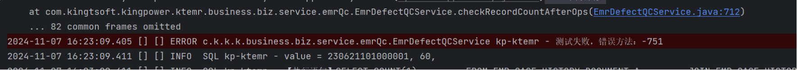
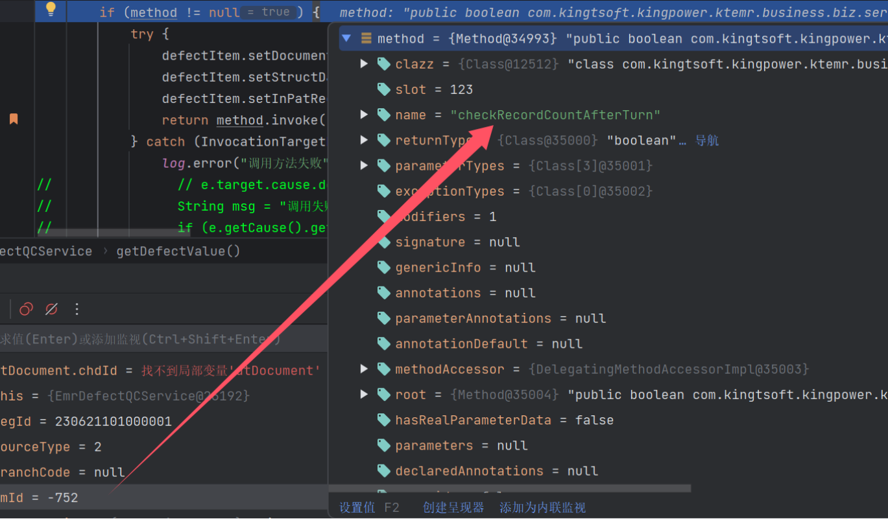
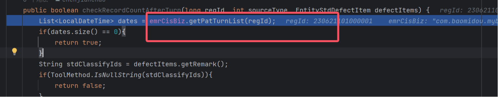
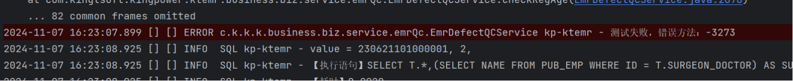
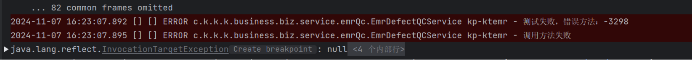

# Oracle数据库部分代码测试不通过

## -751

| Mapper查数据的SQL问题不对 |
| ------------------------- |

## -752

Mapper查数据的SQL问题不对

## -781

Mapper查数据的SQL问题不对

## -3040

| 第一次启动后报错，后续调试无异常 |
| -------------------------------- |

## -3273

| 内部方法报NPE |
| ------------- |

## -3283

内部方法报NPE

## -3298

| 内部Mapper有问题 |
| ---------------- |
