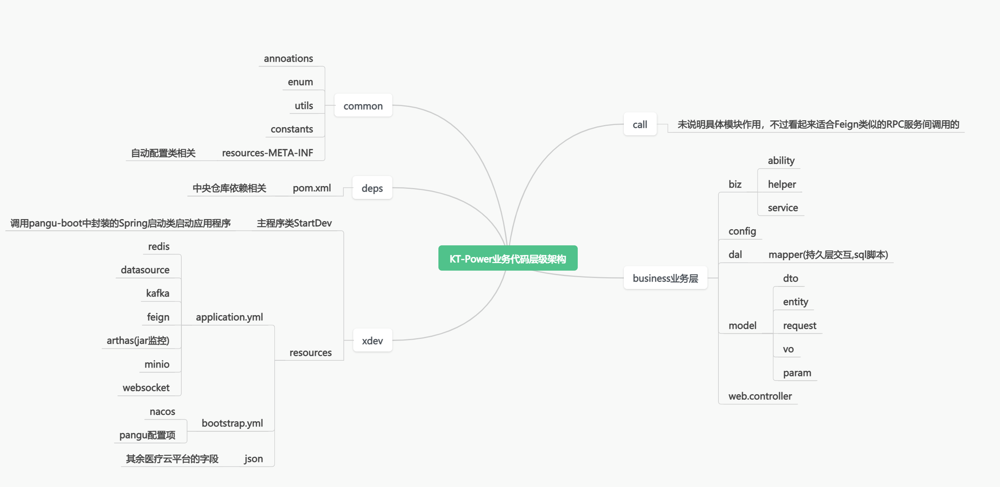
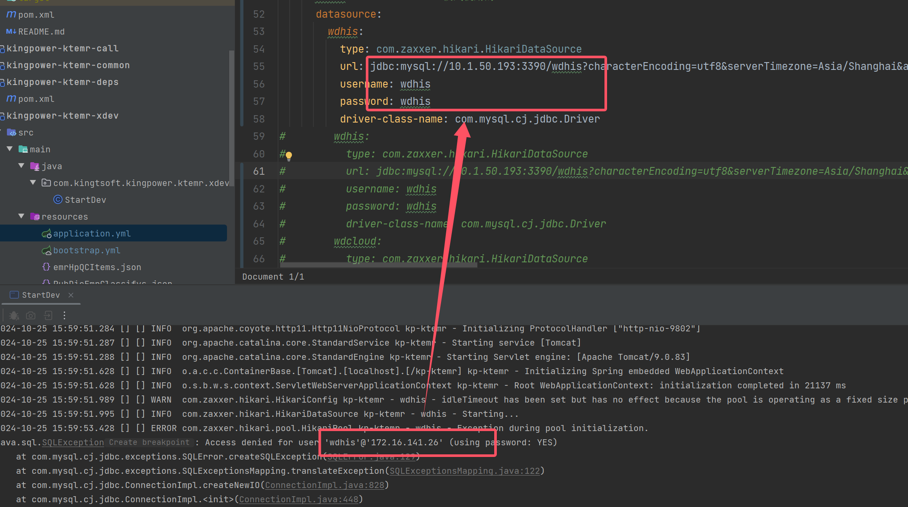
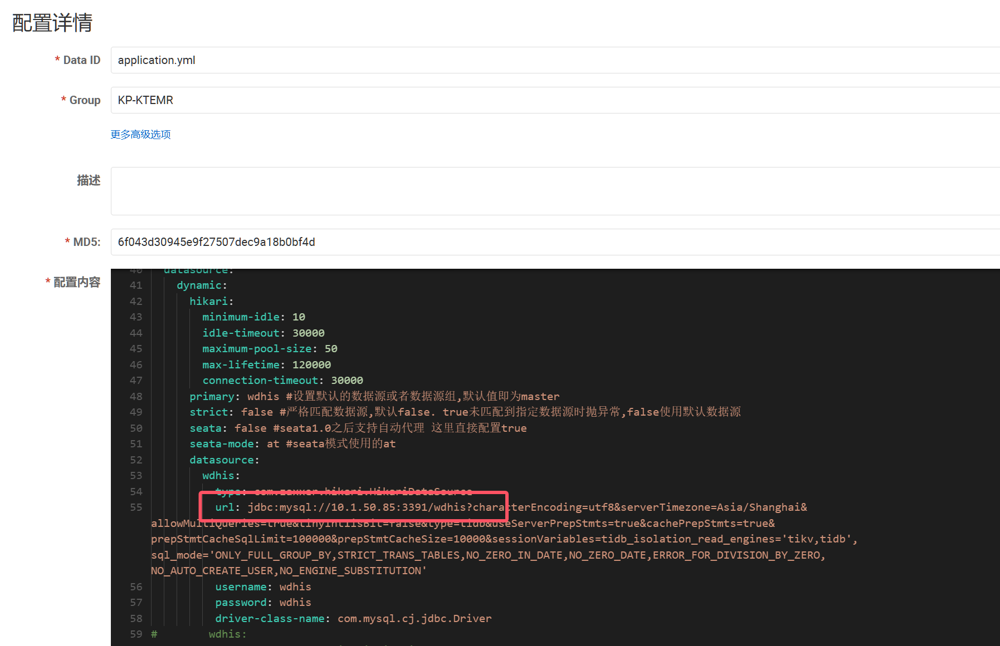

# 业务代码架构和各层作用分析



代码包层级架构如上图

数据库配置：

```
# from nacos
mysql-pangu:
          type: com.zaxxer.hikari.HikariDataSource
          url: jdbc:mysql://10.1.50.61:3306/pangu?characterEncoding=utf8&serverTimezone=Asia/Shanghai&allowMultiQueries=true
          username: root
          password: kingwisedb
```





解决：修改数据库路径为开发库：

```
jdbc:mysql://10.1.50.85:3391/wdhis?characterEncoding=utf8&serverTimezone=Asia/Shanghai&allowMultiQueries=true&tinyInt1isBit=false&type=tidb&useServerPrepStmts=true&cachePrepStmts=true&prepStmtCacheSqlLimit=100000&prepStmtCacheSize=10000&sessionVariables=tidb_isolation_read_engines='tikv,tidb',sql_mode='ONLY_FULL_GROUP_BY,STRICT_TRANS_TABLES,NO_ZERO_IN_DATE,NO_ZERO_DATE,ERROR_FOR_DIVISION_BY_ZERO,NO_AUTO_CREATE_USER,NO_ENGINE_SUBSTITUTION'
```

SwaaggerUI的接口地址为：

```
http://localhost:9802/kp-ktemr/swagger-ui/index.html
```

Nacos控制地址为：

```
http://10.1.50.63:8848/nacos/#/configurationManagement?dataId=&group=&appName=&namespace=&namespaceShowName=public&pageSize=&pageNo=
```
