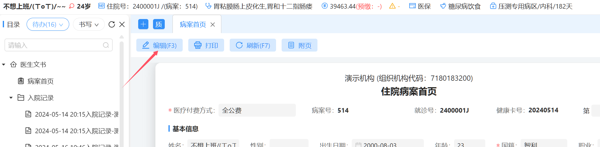
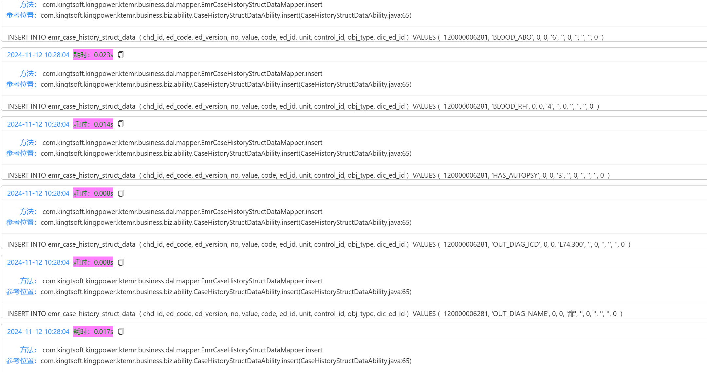
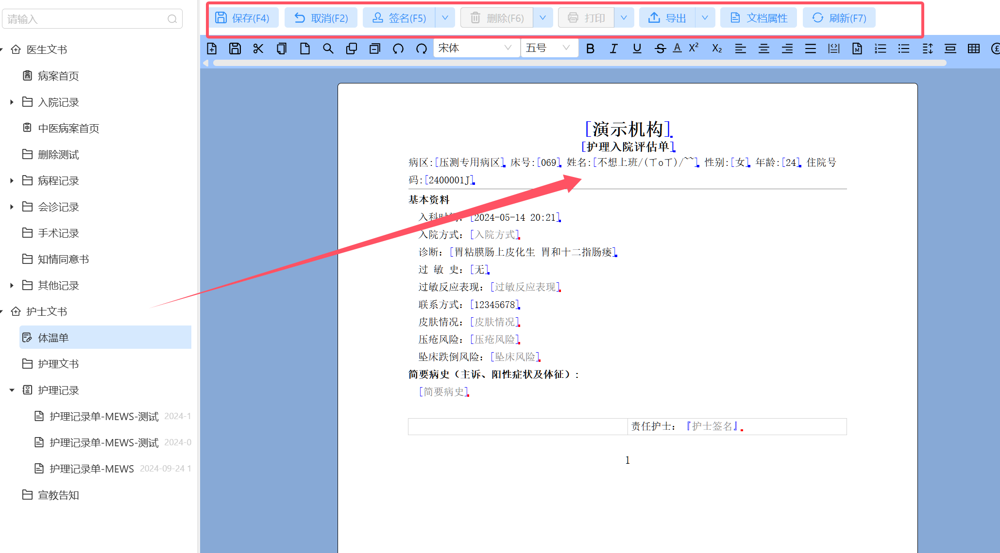
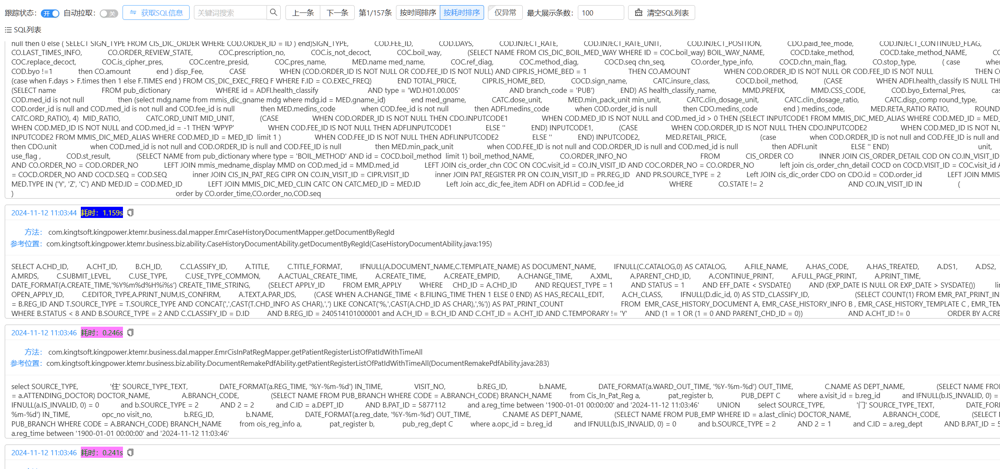
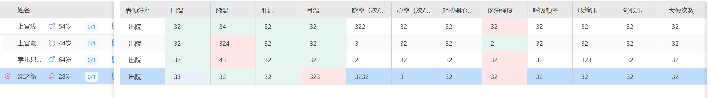
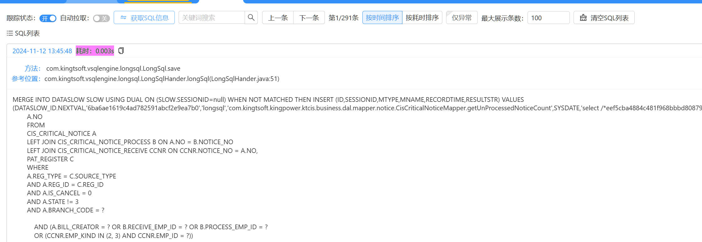
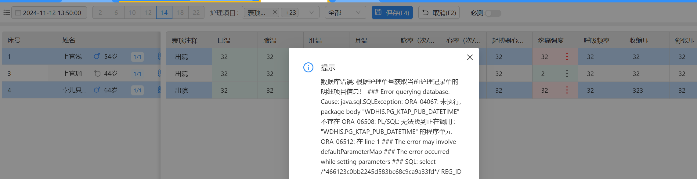
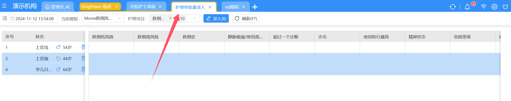

# 异常SQL数据查询

## 异常概览：

| 分类     |             事件             | 执行规模 |
| -------- | :---------------------------: | :------: |
| 病案首页 |        填写信息后保存        |  291条  |
| 病案首页 |             打印             |  289条  |
|          |                              |          |
| 病历文书 |        填写信息后保存        |  172条  |
| 病历文书 |             签名             |  211条  |
|          |                              |          |
| 护理文书 |       填写信息-点击保存       |  157条  |
|          |                              |          |
| 体温单   | 批量录入（护理项目全选）-保存 |  291条  |
|          |                              |          |
| 护理单   |               /               |    /    |

### 病案首页

#### 病案首页-编辑病案首页-4条-正常

#### 病案首页-填写信息后保存-291条 较多的空插入语句和重复的查询

#### 病案首页-打印-289条-执行了较多查询和空的插入语句

#### 病案首页-刷新-18条-正常

#### 异常总结

|      事件      | 执行规模 |
| :------------: | :------: |
| 填写信息后保存 |  291条  |
|      打印      |  289条  |

### 病历文书

#### 病历文书-点击+号-80条 正常

#### 病历文书-编辑-放开申请并编辑-74条-正常

#### 病历文书-填写信息后保存-172条

#### 病历文书-签名-211条-较多的无用查询

#### 病历文书-打印-28条-导出-2条-获取文档属性-9条-刷新-64条-删除-34条 正常

#### 异常总结

|      事件      | 执行规模 |
| :------------: | :------: |
| 填写信息后保存 |  172条  |
|      签名      |  211条  |

### 护理文书

#### 护理文书-新增护理文书-护理入院评估单子-66条-正常

#### 护理文书-填写信息-点击保存-157条-较多的查询

#### 护理文书-保存后编辑-18条-取消-9条-签名-60条-打印-32条-导出-2条-文档属性-11条-刷新-20条

#### 异常总结

| 事件              | 执行规模 |
| ----------------- | -------- |
| 填写信息-点击保存 | 157条    |

### 体温单批量录入

事件触发：通过病区统一录入体温单信息

测试项：

插入数据保存

#### 体温单-批量录入（护理项目全选）-保存-291条-查询项目较多

尝试测试部分选入录入报错如下：

#### 体温单-批量录入-刷新-4条

| 事件                          | 执行规模 |
| ----------------------------- | :------: |
| 批量录入（护理项目全选）-保存 |  291条  |

### 护理单-批量录入

#### 护理单-批量录入（护理项目全选）-保存-70条（信息填写项不明，下拉框无数据）

#### 护理单-录入数据并取消录入-4条-护理项目选择-2条-刷新-10条
