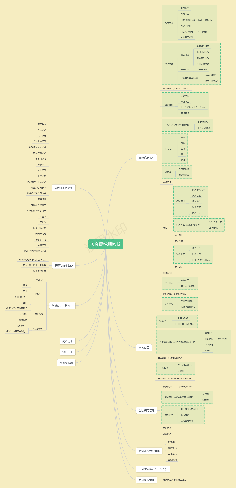
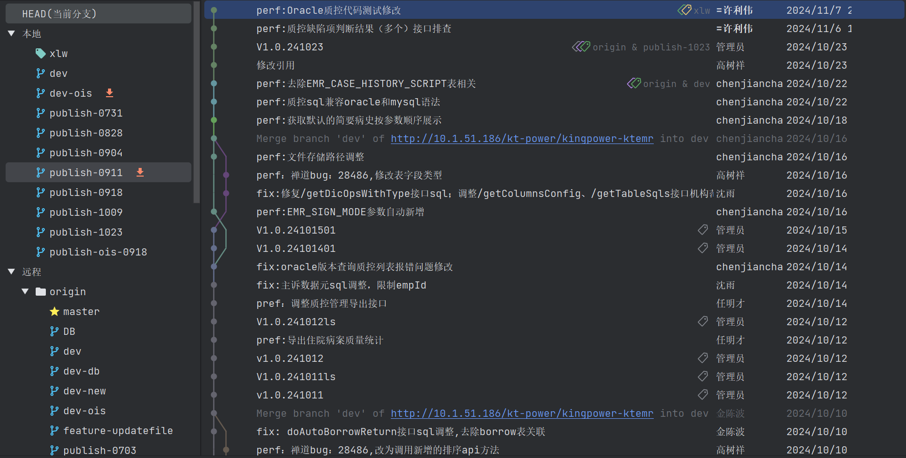
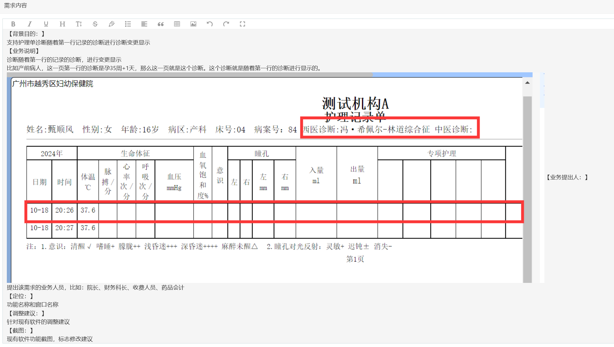
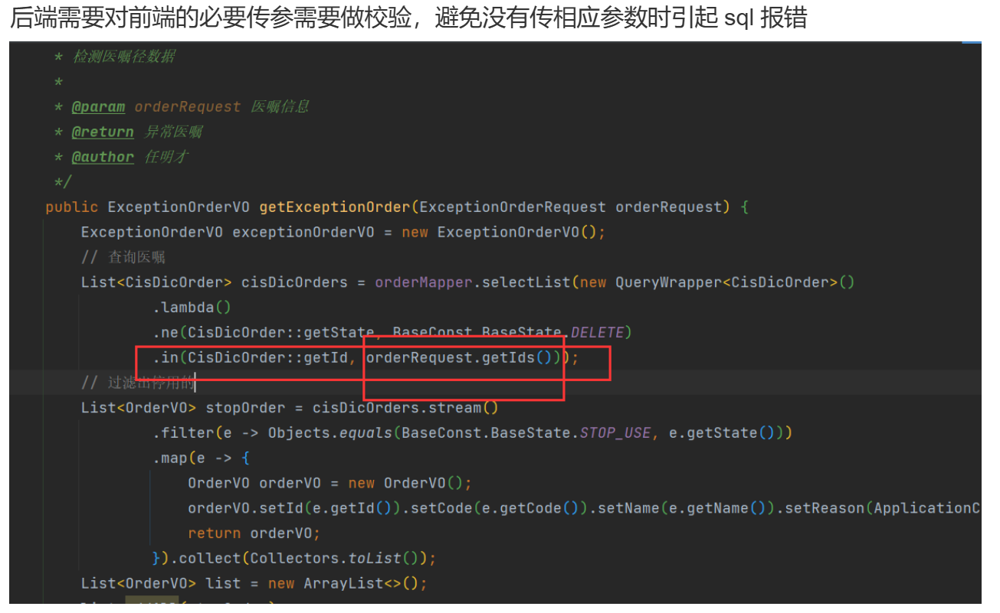
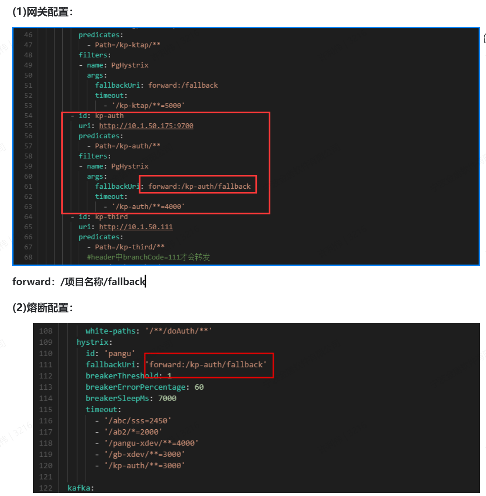
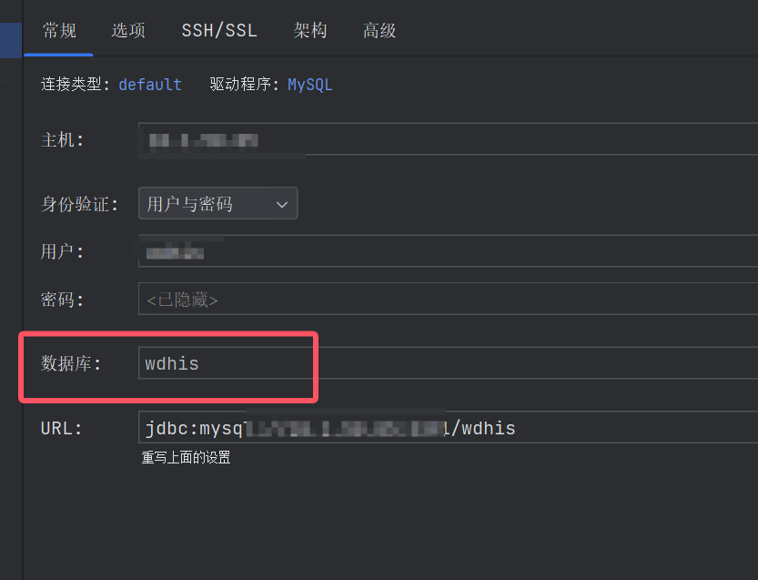
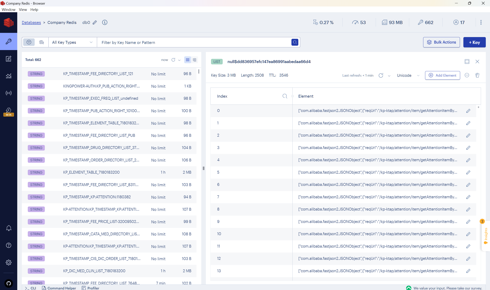
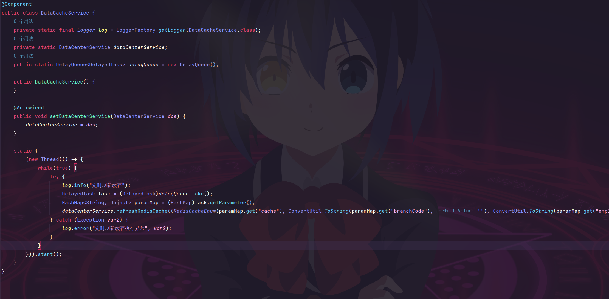
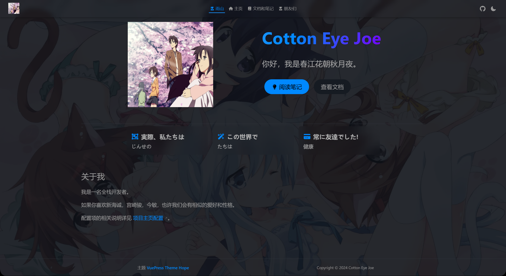

# 病历-临床后端实习技术简帖

> 这篇帖子是在我作为后端实习生时长一个月时间完成，主要是我本人实习期间学习和部门文档学习的整理，希望能够帮助之后加入我们这个团队的实习生们。
>
> 如果你是一名前端实习生，也许你也可以阅读其中的业务介绍部分，希望能帮助你熟悉一点。文字浅显，还请见谅。

## 部门工作方面

实习生期间需要每天登录一次业财一体化，（不在公司的话用VPN，一般不涉及这种情况），完成日报和周报的工作，按照部门要求，汇报工作时各项工作是需要体现处实际工作量的。实习生不要求加班，加班需要在钉钉上申请，当然自己留下来进行学习也是可以的个人感觉。

## 业务介绍和开发问题

##### 我们部门是做什么的？

我们部门是电子病历部门主要负责住院、门诊、病历病案管理、病历质控、医生交接班等业务开发。目前版本已经迭代到7.0（截止2024.11.20），上一版本代码5.0则基于C#开发。公司的其他部门则涉及临床、经济、全科、药事。

##### 有部门的业务思维导图吗？

是的，以下这部分思维导图是我基于部门软件需求规格书完成的，可以对照下面的思维导图阅读规格书快速了解部门业务。



##### 后端选手会涉及到哪些代码？

作为后端实习生，你将会涉及到两套后台系统代码的学习。

1. KT-EMR 病历系统
2. KT-CIS 临床系统

##### 我们部门的数据库是怎样的？

我们部门的数据库是基于MySQL系的。

一是TIDB数据库（建议不懂的实习生可以尝试去官网查看相关文档，目前来看TIDB6.0的语法是等价于MySQL8.0的）

二是Oracle数据库，也就是Oracle11g。

##### 我们使用什么JDK版本和ORM框架，如何适配两套不同的数据库？

使用JDK11和Mybatis-Plus。所以Lamda表达式和接口方法是存在的。

按照我对公司私服库中的代码理解。公司使用内部封装的函数转换器或者SQL工具类来进行两种类型数据库SQL的转换。同时在两套代码系统中是根据条件构造器例如 `<if></if>`。判断数据库类型并适配不同的函数，例如NVL和IFNULL，当然其实都可以使用CASE  WHEN来适配条件。

##### 我们部门的开发流程是什么样的？

部门的代码仓库是私服，使用的是GitLab，请向老大（曹老板）申请Git账号。

每周三是发布日，将会更新发布到publish分支，此后测试部门会对分支进行测试。同时publish分支是保留三个月的（便于回退处理）

周内的dev分支代码提交期间每天的提交都有人处理合并操作。如果你的分支出现了拉取拒绝，这里建议使用**git pull --rebase**来处理。



比如这样子，注意提交代码时的代码提交信息必须规范，具体见开发规范部分。

##### 我们如何进行需求管理？

公司的需求管理平台是禅道和业财一体化


开发流程控制如上，需求信息界面会展示具体更新的需求功能和需求上线等信息，以前端需求为例，将会展示具体按钮，病历文书页眉随场景（孕妇）变化，时间信息等。

需求总览：



##### 我们的数据集从哪里来？中间件Redis，消息队列MQ用了嘛？

以病案首页为例进行分析，前端的数据填充就有必填项，只读项，读存项等，这些数据来源是不同的，不同于一般的后端开发思维，就认为是通过SQL查询结构化数据，部门的这些数据是根据数据类型进行分类化查询再进行同一整合响应返回的。

关于中间件，由于公司代码已经对spring框架进行了封装套壳，各种中间件starter也不例外，所以关于这部分实习生基本不涉及，同时日常开发也只需要导入对应的Template模板使用即可。消息队列公司使用的是KafKa，可以去了解下这部分消费者组的知识。

项目再启动时，将会进行KafKa消费者和发布者组的初始化，可以到对应模块的源码中进行学习。

##### 我们实习生上手工作的基本流程是怎样的?

也许有的公司是从负责一个小的项目开始，搭建，设计，大致流程过完。负责一些模块和工作内容。

但我们团队工作主要还是对业务，可能最先还是要你分析下软件需求规格书和医疗云平台，熟悉业务。之后逐步接手一些代码中SQL处理，做一些表格之类的工作。这块建议自己去看看公司的源码或者两套业务代码中部分接口的设计思想。整理出接口涉及的类和数据表，画一画UML图之类的事情。

## 开发规范

> 下面是部门的部分代码规范和我对这些规范的解释和思考。

#### 命名规范

严格按照小驼峰命名，转换过程中发现之前命名不规范的直接进行调整处理。

命名方式：小驼峰命名规范

```sql
首字母小写：命名的第一个单词的首字母小写。
后续单词首字母大写：从第二个单词开始，每个单词的首字母大写。
单词之间无分隔符：单词之间没有空格或其他分隔符。
以下是一些符合小驼峰命名规范的示例：
变量命名：firstName、lastName、age、isStudent。
函数命名：calculateSum、printMessage、getData。
方法命名：setName、getName、updateAge。

```

区别于小驼峰命名规范，下面是大驼峰命名规范：

```java
大驼峰命名规范（Upper Camel Case），也被称为帕斯卡命名法（Pascal Case），也是一种常见的编程命名规范，具体规则如下：
每个单词的首字母大写：组成名称的每个单词的首字母都大写，而不仅仅是第一个单词的首字母。
单词之间无分隔符：与小驼峰命名法类似，单词之间没有空格或其他分隔符。
```

#### 设置git提交时的用户名：

```
git config --global user.name "提交预期登记的用户名称。" 
```

#### 未完成事项：

有问题或者未填写内容，统一添加 //TODO 进行标记，后面统一处理

#### MYSQL特殊语法：

```SQL
INSERT INTO table_name (column1, column2, column3,...)
VALUES (value1, value2, value3,...)
ON DUPLICATE KEY UPDATE
    column1 = value1,
    column2 = value2,
    column3 = value3,
   ...;
```

解释：

* `ON DUPLICATE KEY UPDATE`：这是该语法的关键部分，用于在插入数据时，如果遇到唯一键冲突（即插入的数据与表中已有的数据在唯一键上的值相同），则执行更新操作。

不允许特殊化语法，SQL要考虑兼容多种类型数据库，不要出现特殊化语法。

#### 敏感信息加密处理：

禁止将密码返回给前端，如果需要修改密码判断，应该通过走后端接口校验



#### List获取元素

使用List集合接口的时候，不建议使用get操作，因为不确定集合是否含有元素，可能会发生NPE异常。

> list如果要按下标方式获取数据的，在不能确保数据一定可以获取得到的情况下，一定要进行前置判断，建议非必要尽量不要使用get(i)这种方式

#### 不能使用SELECT * 操作！

> 数据库查询不要使用*，使用select * 取出全部列，会让优化器无法完成索引覆盖扫描这类优化，会影响优化器对执行计划的选择，也会增加网络带宽消耗，更会带来额外的I/O,内存和CPU消耗，建议提出业务实际需要的列数，将指定列名取代select *。实际上个人感觉没啥问题，就是会影响覆盖索引。

#### 不要使用冷门函数

不要使用冷门函数，尽量使用通用函数。

#### 获取数据库时间

后端新增时间、修改时间 存储时调用该方法获取，禁止使用LocaldateTime.now()方式

使用示例：

```java
DateUtil.getDbTime();
```

#### 后端公共排序方法【id，ord类型】

后端有按ord拖拽排序的修改下，统一了前后端的入参方式，后端使用调用公共方法方式处理

前端传参[{id:1,ord:1},{id:2,ord:2}...]即可

2022-11-21优化：增加了空值判断检测

2022-11-17优化：支持前端ord为旧值情况下后端的重排序，也兼容之前旧的写法

#### 树形转换【id，pid模式】

提供如下几种

使用示例：

```Java、
CommonTreeUtil.listToTreeEx(MenuAuthVO.class, menuList,TreeParentMenuAuthVO.class, parentMenus,"id","parentId","children");
```

#### 服务部署的硬件条件：

```
数据库：
TiDB（6.0版本）

需要部署服务：
云HIS所有MySQL服务器，包含：框架、接口、云经济、云药事、云全科。
KingPower服务（ktap、ktcis、ktemr）。
redis服务
nginx服务

服务器：
Linux服务器
内存：32G
处理器：8核
硬盘：300G
```

#### MySQL和TIDB的兼容性问题

版本对应：TIDB6.0对应MySQL8.0

语法上基本完全相同

配置文件数据库连接：

可参考（type=tidb是进行的一个标识，我们主要是sql跟踪的时候会有用到

```yml
 datasource:
    dynamic:
      primary: wdhis #设置默认的数据源或者数据源组,默认值即为master
      strict: false #严格匹配数据源,默认false. true未匹配到指定数据源时抛异常,false使用默认数据源
      seata: false #seata1.0之后支持自动代理 这里直接配置true
      seata-mode: at #seata模式使用的at
      datasource:
        wdhis:
          type: com.zaxxer.hikari.HikariDataSource
          url: jdbc:mysql://10.1.50.193:3391/wdhis?characterEncoding=utf8&serverTimezone=Asia/Shanghai&allowMultiQueries=true&tinyInt1isBit=false&type=tidb
          username: wdhis
          password: wdhis
          driver-class-name: com.mysql.cj.jdbc.Driver
```

执行计划查询：

```sql
EXPLAIN 语句只返回查询的执行计划，并不执行该查询。若要获取实际的执行时间，可执行该查询，或使用 EXPLAIN ANALYZE 语句
```

**子查询内存上限：**

大sql执行可能存在内存溢出情况，目前我们的tidb默认单条sql运行内存为2G，一般内存溢出是子查询引起，需要对子查询进行优化或者拆分出来单独处理

tidb聚合函数较弱，通常要配合group by 来减少结果集或以此来命中索引

#### 服务熔断

###### 1. 单接口的熔断

单接口的熔断，在原来接口上增加/fallback路径，需要和研发确认该接口存在，相当于个性配置

配置单个接口熔断的时候是这样子的：


当超时超过参数timeout: 访问路径带有 /kp-auth 下的所有路径 超过4秒 跳转到所访问的路径下加上 /fallback

例如： /ktap/a/b      -->     /ktap/a/b/fallback    发生转移

配置信息：

```yml
hystrix:
id: 'pangu'
fallbackUri: 'forward:/fallback'   #触发后转发到的接口路径
breakerThreshold: 1     #断路器的阈值数
breakerErrorPercentage: 60     #百分比阈值数
breakerSleepMs: 7000     #断路器触发后的休眠时间  
timeout:
  - '/abc/sss=2450'
  - '/ab2/*=2000' 
  - '/pangu-xdev/**=4000'
  - '/gb-xdev/**=3000'
  - '/kp-auth/**=3000'    #超时时间，对应的是上面转发的接口超时时间
```

###### 配置整个项目的熔断



> 生效问题：网关配置 nacos发布后 即时生效！！

#### SQL瘫痪真实案例分析（2024年10月16日）

事故情况：**TiDB**服务器** **CPU100%** **，导致整个系统处于瘫痪状态！！！**

**主要原因：**

 **1** **）数据库****SQL****隐式转换，会自动转换成关联子查询；**

 **2**  **）** **OIS_ORDER_DETAIL****是个大表，查询数据量大，内存消耗大；**

 **3** **）全主业务在用，高峰期使用频率**

###### 标量子查询 ：

标量子查询是一种特殊类型的子查询，它返回的结果是一个单一的值（即一个标量），而不是一个数据集。它通常用于在主查询中作为一个条件或者表达式的一部分，为查询提供动态的、基于数据的条件或值。

###### 语法结构

标量子查询的语法结构类似于普通的子查询，只是它的结果必须是一个单一的值。例如：

```sql
SELECT column_name
FROM table_name
WHERE condition = (SELECT scalar_value FROM another_table WHERE another_condition);
```

在这个例子中，括号内的子查询 `(SELECT scalar_value FROM another_table WHERE another_condition)` 就是一个标量子查询，它返回的单一值将与主查询中的 `condition` 进行比较。

###### 特点

* **返回单一值** ：这是标量子查询的核心特点，它与其他类型的子查询（如返回多行多列的子查询）区别开来。
* **可以嵌套使用** ：标量子查询可以嵌套在其他查询或表达式中，以构建更复杂的查询逻辑。
* **与外部查询相关联** ：标量子查询通常依赖于外部查询中的值，通过引用外部查询的列或表达式来生成动态的条件或值。

###### 应用场景

* **作为查询条件** ：用于在 `WHERE` 子句中提供动态的筛选条件。例如，根据另一个表中的某个值来筛选当前表中的数据。
* **用于计算列值** ：在 `SELECT` 语句中，作为一个表达式来计算新的列值。例如，根据其他列的值进行一些数学运算或逻辑判断，生成一个新的列。
* **数据验证和关联** ：在数据插入或更新操作中，用于验证数据的合法性或关联其他表中的数据。

###### 示例

假设有两个表：`orders` 表包含订单信息，`customers` 表包含客户信息。要查询所有订单金额大于某个特定客户平均订单金额的订单，可以使用标量子查询来实现：

```sql
SELECT order_id, order_amount
FROM orders
WHERE order_amount > (SELECT AVG(order_amount) FROM orders WHERE customer_id = 123);
```

在这个例子中，子查询 `(SELECT AVG(order_amount) FROM orders WHERE customer_id = 123)` 返回了客户 `123` 的平均订单金额，然后主查询筛选出订单金额大于该平均金额的订单。

###### 注意事项

* **性能问题** ：如果标量子查询的执行效率低下，可能会影响整个查询的性能。因此，在使用标量子查询时，需要注意优化子查询的执行计划。
* **结果的确定性** ：标量子查询必须返回一个确定的单一值，如果子查询返回多个值或者没有值，将会导致错误。
* **与外部查询的关联性** ：标量子查询依赖于外部查询的环境，如果外部查询的条件发生变化，可能会影响子查询的结果。因此，在使用标量子查询时，需要确保子查询与外部查询的关联性是正确的。c创

#### 创建不可修改的Map

```java
 public static final Map<String, String> BASE_HEADERS;
        static {
            Map<String, String> baseHeaders = new LinkedHashMap<>();
            baseHeaders.put("statusName", "审核状态");
            baseHeaders.put("applyNo", "申请序号");
            baseHeaders.put("requestName", "申请人员");
            baseHeaders.put("requestReason", "申请理由");
            baseHeaders.put("mrNo", "病案号");
            baseHeaders.put("visitNo", "就诊号");
            baseHeaders.put("patName", "姓名");
            baseHeaders.put("idCard", "身份证号");
            baseHeaders.put("dept", "科室");
            baseHeaders.put("wardName", "病区");
            baseHeaders.put("cisDiagNamePri", "临床主诊断");
            baseHeaders.put("inDiagName", "首页主诊断");
            baseHeaders.put("verifyEmpName", "审核人员");
            baseHeaders.put("failureReason", "拒绝理由");
            BASE_HEADERS = Collections.unmodifiableMap(baseHeaders);
        }
```

#### 根据有限元素创建列表

使用有限元素构建方法：

```java
 public static final List<String> MED_HEADERS = List.of(
            "病案号", "就诊号", "电子状态", "姓名", "身份证号", "病区",
            "科室", "主管医生", "入院日期", "出院日期", "住院天数",
            "临床主诊断", "首页主诊断", "费别", "送交人员", "签收人员",
            "编码人员", "质控人员", "归档人员"
    );
```

###### 换行符

字符串末尾的 `\r\n`是回车符（Carriage Return）和换行符（Line Feed）的组合，通常用于表示文本的换行。这块在代码中见得比较多所以我写上来。

#### 数据库版本


#### 选择数据库架构，让Mapper.xml少一点爆红



#### BigDecimal的精度数据的比较


#### Redis缓存规模：



#### 一定要加@Autowired注解吗？？

> 在 Spring4.x 中增加了新的特性：如果类只提供了一个带参数的构造方法，则不需要对对其内部的属性写 @Autowired 注解，Spring 会自动为你注入属性。

spring在4.x版本后就推荐使用构造器的方式的来注入fileld。公司的代码一般是采用构造器注入方法，再类上面加上lombok插件的构造方法注解即可。

#### 分析一下什么时候会使用到事务的注解：


根据常识，涉及到增删改的操作基本上都有事务的存在，而且公司业务数据量基本上都和DB直接获取，来看看这个操作的全流程。


看来事务注解加再Service上，那能用细粒度声明式事务注解来细化吗？？？

事实上，控制层和服务service再这里都只是作为代理人进行了业务方法的调用而已，真正涉及业务操作的是ability。那为什么不加在Ability层面上呢？下为豆包同学的回答：

> 事务注解一般加在 Service 层而不是 Mapper 操作层面或 Ability 层面，主要有以下原因：
>
> * **Mapper 操作层面** ：
> * **职责单一性** ：Mapper 层（数据访问层）的主要职责是与数据库进行交互，执行具体的 SQL 操作，如增删改查等。它只关注数据的持久化和读取，不应该包含业务逻辑。如果在 Mapper 层方法上添加事务注解，会使 Mapper 层不仅要处理数据访问，还要负责事务管理，这违背了职责单一原则，导致代码的耦合度增加，不利于代码的维护和扩展。例如，当需要修改事务的传播行为或隔离级别时，需要在多个 Mapper 方法中进行修改，增加了出错的风险。
> * **细粒度控制困难** ：在实际应用中，一个业务操作可能涉及多个 Mapper 方法的调用。如果在每个 Mapper 方法上都添加事务注解，会导致事务的粒度过于细小，增加了事务管理的复杂性。例如，一个订单创建的业务操作可能需要调用插入订单主表、插入订单详情表、更新库存等多个 Mapper 方法。如果每个方法都有自己的事务，那么在出现异常时，很难准确地控制事务的回滚范围，可能会导致部分数据更新成功，部分数据更新失败，从而破坏数据的一致性。而在 Service 层方法上添加事务注解，可以将整个业务操作作为一个事务进行管理，方便对事务进行统一的控制和协调。
> * **性能问题** ：事务的开启和提交是有一定开销的，如果在 Mapper 层的每个方法上都添加事务注解，会导致事务的频繁开启和提交，增加了系统的性能开销。特别是在高并发的情况下，这种性能开销可能会对系统的性能产生较大的影响。而在 Service 层方法上添加事务注解，可以将多个相关的 Mapper 方法放在一个事务中执行，减少事务的开启和提交次数，提高系统的性能。
> * **Ability 层面** ：
> * **与业务逻辑的耦合度** ：虽然 Ability 真正使用 Mapper 来操作数据库，但 Ability 通常是对业务能力的抽象，它可能包含了多个业务操作的组合。如果在 Ability 层面上添加事务注解，会使 Ability 与具体的业务逻辑紧密耦合，不利于 Ability 的复用和扩展。例如，一个 Ability 可能提供了创建订单、查询订单、取消订单等多个业务操作，每个操作可能涉及不同的 Mapper 方法调用。如果在 Ability 层面上添加事务注解，那么当需要修改某个业务操作的事务行为时，可能会影响到其他业务操作，增加了代码的维护难度。
> * **事务传播的复杂性** ：事务传播是指在多个事务方法之间的调用关系中，如何管理事务的行为。在 Spring 框架中，事务传播有多种方式，如 REQUIRED、SUPPORTS、MANDATORY 等。如果在 Ability 层面上添加事务注解，需要考虑事务传播的问题，以确保事务的正确执行。例如，当一个 Ability 方法调用另一个 Ability 方法时，需要根据业务需求确定事务的传播行为，是在同一个事务中执行，还是开启新的事务。这增加了事务管理的复杂性，容易出现事务传播错误的情况。而在 Service 层方法上添加事务注解，可以根据业务方法的具体需求，灵活地配置事务传播行为，简化了事务管理的复杂性。
> * **可测试性** ：在进行单元测试时，通常需要对 Service 层的方法进行单独测试，以验证业务逻辑的正确性。如果在 Ability 层面上添加事务注解，那么在测试 Service 层方法时，可能会受到事务的影响，导致测试结果不准确。例如，当测试一个 Service 层方法时，可能会因为事务的提交或回滚，导致数据库中的数据发生变化，从而影响到后续的测试用例。而在 Service 层方法上添加事务注解，可以方便地在测试时控制事务的行为，例如通过配置事务的传播行为为 NEVER，来禁止事务的开启，从而提高测试的准确性和可重复性。

## KT-EMR部分代码分析

> 这部分是我在公司实习期间的一部分代码分析和调试部分的过程分析，希望能够帮到你。思维相对来说比较跳，简单来说你可以理解为通过启动项目后分析对应的初始化工作分析具体执行的内部业务逻辑。

#### 数据缓存服务-队列+线程

在项目启动的时候，你会发现控制台进行了缓存刷新日志，实际上根据源代码分析，是执行了下面这个代码的逻辑：



由于使用了静态代码块创建的独立线程作为缓存刷新的工作任务，通过在延时队列中获取相应的任务来进行任务的获取。与一般的思想不同的是这里使用了静态方法创建线程的办法，使得这个线程将会在整个应用中从一而终地执行任务。

#### 消息消费处理类-KafKa消息队列

我们来看看代码中的整个的消费者处理类为：

```java
@Component
public class KafkaConsumerManager {
    private static final Logger log = LoggerFactory.getLogger(KafkaConsumerManager.class);
    private final ConsumerFactory<String, Object> consumerFactory;
    private final ApplicationContext applicationContext;
    private static final Map<String, MessageListenerContainer> KAFKA_CONSUMER_THREAD_MAP = new LinkedHashMap();

    public KafkaConsumerManager(ConsumerFactory<String, Object> consumerFactory, ApplicationContext applicationContext) {
        this.consumerFactory = consumerFactory;
        this.applicationContext = applicationContext;
    }

    public synchronized void addConsumer(String key, KafkaListenerInfoProperties consumerInfo) {
        if (!ObjectUtils.isEmpty(consumerInfo)) {
            this.stopByConsumerId(key);
            MessageListenerContainer kafkaMessageListener = this.buildKafkaListenerContainerFactory(consumerInfo);
            KAFKA_CONSUMER_THREAD_MAP.put(key, kafkaMessageListener);
            kafkaMessageListener.start();
            log.info("创建消费者: {} 成功！", key);
        }
    }

    public void stopByConsumerId(String consumerId) {
        if (StringUtils.hasText(consumerId)) {
            MessageListenerContainer kafkaMessageListenerContainer = (MessageListenerContainer)KAFKA_CONSUMER_THREAD_MAP.get(consumerId);
            if (!ObjectUtils.isEmpty(kafkaMessageListenerContainer)) {
                kafkaMessageListenerContainer.stop();
                KAFKA_CONSUMER_THREAD_MAP.remove(consumerId);
                log.info("停止消费者: {} 成功！", consumerId);
            }
        }
    }

    private MessageListenerContainer buildKafkaListenerContainerFactory(KafkaListenerInfoProperties consumerInfo) {
        Assert.hasText(consumerInfo.getTopics(), "主题名称不能为空！");
        String[] topics = consumerInfo.getTopics().split(",");
        PgKafkaBatchMessageService pgKafkaBatchMessageService = this.getPgKafkaBatchMessageService(consumerInfo.getServiceCode());
        PgMessageListener pgMessageListener = this.getPgMessageListener(consumerInfo.getServiceCode());
        if (pgKafkaBatchMessageService == null && pgMessageListener == null) {
            throw new RuntimeException("主题" + consumerInfo.getTopics() + "无法找到对应的实现信息");
        } else {
            ConsumerFactory<String, Object> factory = new DefaultKafkaConsumerFactory(this.consumerFactory.getConfigurationProperties());
            ContainerProperties containerProperties = new ContainerProperties(topics);
            containerProperties.setGroupId(consumerInfo.getGroup());
            if (StringUtils.hasText(consumerInfo.getAckMode())) {
                try {
                    containerProperties.setAckMode(AckMode.valueOf(consumerInfo.getAckMode().toUpperCase()));
                    Map<String, Object> map = new HashMap();
                    map.put("enable.auto.commit", false);
                    factory.updateConfigs(map);
                } catch (Exception var8) {
                    log.error("自定义监听ACK模式错误{}", consumerInfo.getAckMode());
                }
            }

            containerProperties.setMessageListener(new KafkaBatchAckMessageListener(pgKafkaBatchMessageService, pgMessageListener));
            ConcurrentMessageListenerContainer<String, Object> listenerContainer = new ConcurrentMessageListenerContainer(factory, containerProperties);
            if (consumerInfo.getConcurrency() != null) {
                listenerContainer.setConcurrency(consumerInfo.getConcurrency());
            }

            return listenerContainer;
        }
    }
}
```

用到的几个常用成员变量是：

```java
private final ConsumerFactory<String, Object> consumerFactory;//消费者工厂
private final ApplicationContext applicationContext;
private static final Map<String, MessageListenerContainer> KAFKA_CONSUMER_THREAD_MAP = new LinkedHashMap();//消息监听容器
```

自定义的KafKa消费者信息Info类：

```java

public class KafkaListenerInfoProperties implements Serializable {
    private String topics;
    private String group;
    private String serviceCode;
    private String ackMode = "BATCH";
    private Integer concurrency;

    public KafkaListenerInfoProperties() {
    }
}
```

#### 自定义的任务调度PgJob

部门代码将会通过resources文件夹下META-INF/pg-job.json文件进行任务创建

```java
@EnableAspectJAutoProxy(
    proxyTargetClass = true
)
@Configuration
public class PgJobInitializing implements ApplicationRunner {
    private static final Logger log = LoggerFactory.getLogger(PgJobInitializing.class);
    private final DefaultListableBeanFactory beanFactory;

    public PgJobInitializing(DefaultListableBeanFactory beanFactory) {
        this.beanFactory = beanFactory;
    }

    public void run(ApplicationArguments args) {
        if (this.beanFactory != null) {
            try {
                ClassLoader classLoader = Thread.currentThread().getContextClassLoader();
                InputStream inputStream = classLoader.getResourceAsStream("META-INF/pg-job.json");
                if (inputStream == null) {
                    log.info("[PG_JOB]无有效规则文件");
                    return;
                }

                String json = new String(inputStream.readAllBytes(), StandardCharsets.UTF_8);
                List<PgJobAutoInfo> rules = JSON.parseArray(json, PgJobAutoInfo.class);
                if (rules.isEmpty()) {
                    return;
                }

                Iterator var6 = rules.iterator();

                while(var6.hasNext()) {
                    PgJobAutoInfo rule = (PgJobAutoInfo)var6.next();

                    try {
                        PgJobProxyUtil.replaceBeanProxyFactoryProxy(this.beanFactory, rule.getType());
                    } catch (Exception var9) {
                        log.error("", var9);
                    }
                }
            } catch (Exception var10) {
                PgFastLogger.appError("[PG_JOB]配置自动初始化失败", var10);
            }

        }
    }
}
```

##### 获取类加载器的方法

按照规范，代码中应该使用线程获取当前类的加载器

```java
ClassLoader classLoader = Thread.currentThread().getContextClassLoader();
```

##### 实现方法的代理

这块使用过方法拦截器来执行具体的代理方法逻辑的，可以了解下Interceptor的内部逻辑。公司的很多代码用到了这部分原理，包括对日志和Mybatis-Plus的封装。

```java
@Configuration
public class PlugMethodInterceptor implements MethodInterceptor {
    private static final Logger log = LoggerFactory.getLogger(PlugMethodInterceptor.class);
    private final PgJobState pgJobState;
    private final PgJobTemplate pgJobTemplate;
    private final PgJobProperties pgJobProperties;
    private final ExecutorService pool;

    public PlugMethodInterceptor(PgJobProperties pgJobProperties, PgJobTemplate pgJobTemplate, PgJobState pgJobState) {
        this.pgJobProperties = pgJobProperties;
        this.pgJobTemplate = pgJobTemplate;
        this.pgJobState = pgJobState;
        this.pool = pgJobState.getPool();
        ClassLoader classLoader = Thread.currentThread().getContextClassLoader();
        InputStream inputStream = classLoader.getResourceAsStream("META-INF/pg-job.json");
        if (inputStream == null) {
            log.info("[PG_JOB]无有效规则文件");
        } else {
            String json;
            try {
                json = new String(inputStream.readAllBytes(), StandardCharsets.UTF_8);
            } catch (IOException var9) {
                throw new RuntimeException(var9);
            }

            List<PgJobAutoInfo> rules = JSON.parseArray(json, PgJobAutoInfo.class);
            if (!rules.isEmpty()) {
                Map<String, List<PgJobAutoInfo>> stringListMap = (Map)rules.stream().collect(Collectors.groupingBy(PgJobAutoInfo::getType));
                stringListMap.forEach((type, methods) -> {
                    List<String> strings = new ArrayList();
                    Iterator var4 = methods.iterator();

                    while(var4.hasNext()) {
                        PgJobAutoInfo method = (PgJobAutoInfo)var4.next();
                        strings.addAll(method.getMethods());
                    }

                    pgJobState.putPgJobMethods(type, strings);
                });
            }

        }
    }

    public Object invoke(@NonNull MethodInvocation invocation) throws Throwable {
        List<String> methods = this.pgJobState.getPgJobMethods(invocation.getMethod().getDeclaringClass().getName());
        if (methods != null && !methods.isEmpty()) {
            if (methods.contains(invocation.getMethod().toString())) {
                Object obj = invocation.proceed();
                this.pool.execute(() -> {
                    this.doJobSend(invocation.getArguments());
                });
                return obj;
            } else {
                return invocation.proceed();
            }
        } else {
            return invocation.proceed();
        }
    }

    private void doJobSend(Object params) {
        PgJobInfo pgJobInfo = PgJobInfo.getInstance().jobCode(this.pgJobProperties.getAutoSender().getJobCode());
        this.pgJobTemplate.sendJob(pgJobInfo, params);
    }
}
```

##### 设计架构层次分析，单体的任务调度


#### 代码分析总结

从公司的核心代码，包括消息消费，缓存处理，数据库数据源处理，业务抽象层面的代码到下面的单个部门代码分析来看，上层的代码比下层单部门代码的抽象程度高得多，上层代码设计的业务抽象层次很深，下层代码主要是数据处理层面的，而且大部分的数据直接依靠SQL，通过Collections集合Lamda表达式处理数据，多数据查询使用分页limit逻辑。

#### 代码配置文件

由于业务代码部署配置比较简单，也就是application.yml和bootstrap.yml文件这里我简要做个介绍：

application.yml主要是对应用的简要配置，包括数据源和Redis和pangu代码的配置项之类的。

这下面是Nacos的配置，公司使用的group分组配置，同时云端Nacos的配置项也命名为application.yml，但是我们可以 通过子配置文件的group进行区分，如图：


上面那部分是大的环境隔离，下面那个则是大环境下的配置组，这样子即使他们的配置名是一样的，还是可以通过group来找到对应的配置项。

## 开发工具和学习方法推荐

#### 开发工具

由于公司已明确禁止Navicat的盗版使用，数据库工具我建议使用：

* DataGrip
* DBeaver
* SqlLite

编码工具：

* IDEA
* VScode

流程图和思维导图：

* Draw.io
* WPS

帮助工具：

* 豆包
* Chat-GPT

构建工具：

- Maven（需要向同事问settings.xml）

此外下面是公司的配置中心地址：

[盘古配置中心](http://10.1.51.152:9111/login)

[Nacos-TIDB配置中心](http://10.1.50.63:8848/nacos/#/configurationManagement?dataId=&group=&appName=&namespace=&namespaceShowName=public&pageSize=&pageNo=)

[Nacos-Oracle配置中心](http://10.1.50.42:8848/nacos/#/configurationManagement?dataId=&group=&appName=&namespace=&namespaceShowName=public&pageSize=&pageNo=)

[Maven私服地址](http://10.1.51.186:8081/nexus/#welcome)

[医疗云平台测试地址](http://10.1.50.175/kt-power-his-base/main/index)

#### 学习方法推荐

我平时有使用VScode编写工作任务和代码笔记和思考心得的习惯，直接使用编辑器自带的插件即可，这样或许可以帮助你快速掌握需要干的事情。当然一般情况下开会时老大会把分配的任务发给你，你也可以记下来。

不懂的事情直接在QQ群里问即可。

建议有前端基础的后端实习生可以通过Vue-Press/Hugo/Hexo等主题框架部署自己的笔记博客。这里我选择Vue-Press，以下是我的案例，仅供参考：




