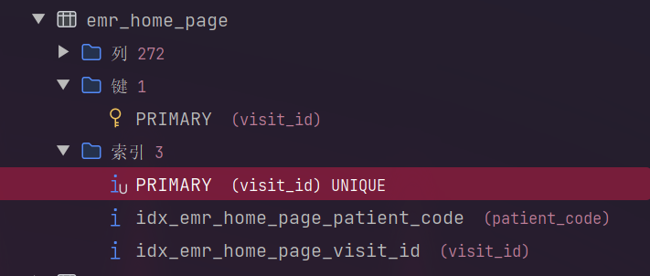
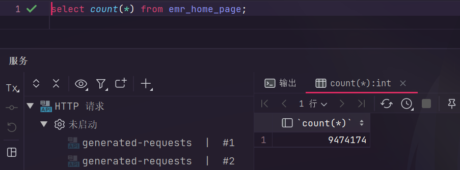

# KingT软件代码分析

#### 数据缓存服务-队列+线程


```java
@Component

public class DataCacheService {
    private static final Logger log = LoggerFactory.getLogger(DataCacheService.class);
    private static DataCenterService dataCenterService;
    public static DelayQueue<DelayedTask> delayQueue = new DelayQueue();

    public DataCacheService() {
    }

    @Autowired
    public void setDataCenterService(DataCenterService dcs) {
        dataCenterService = dcs;
    }

    static {
        (new Thread(() -> {
            while(true) {
                try {
                    log.info("定时刷新缓存");
                    DelayedTask task = (DelayedTask)delayQueue.take();
                    HashMap<String, Object> paramMap = (HashMap)task.getParameter();
                    dataCenterService.refreshRedisCache((RedisCacheEnum)paramMap.get("cache"), ConvertUtil.ToString(paramMap.get("branchCode"), ""), ConvertUtil.ToString(paramMap.get("empId"), ""));
                } catch (Exception var2) {
                    log.error("定时刷新缓存执行异常", var2);
                }
            }
        })).start();
    }
}
```

使用了静态代码块创建的独立线程作为缓存刷新的工作任务，通过在延时队列中获取相应的任务来进行任务的获取。

#### 消息消费处理类-KafKa消息队列

整个的消费者处理类为：

```java
@Component
public class KafkaConsumerManager {
    private static final Logger log = LoggerFactory.getLogger(KafkaConsumerManager.class);
    private final ConsumerFactory<String, Object> consumerFactory;
    private final ApplicationContext applicationContext;
    private static final Map<String, MessageListenerContainer> KAFKA_CONSUMER_THREAD_MAP = new LinkedHashMap();

    public KafkaConsumerManager(ConsumerFactory<String, Object> consumerFactory, ApplicationContext applicationContext) {
        this.consumerFactory = consumerFactory;
        this.applicationContext = applicationContext;
    }

    public synchronized void addConsumer(String key, KafkaListenerInfoProperties consumerInfo) {
        if (!ObjectUtils.isEmpty(consumerInfo)) {
            this.stopByConsumerId(key);
            MessageListenerContainer kafkaMessageListener = this.buildKafkaListenerContainerFactory(consumerInfo);
            KAFKA_CONSUMER_THREAD_MAP.put(key, kafkaMessageListener);
            kafkaMessageListener.start();
            log.info("创建消费者: {} 成功！", key);
        }
    }

    public void stopByConsumerId(String consumerId) {
        if (StringUtils.hasText(consumerId)) {
            MessageListenerContainer kafkaMessageListenerContainer = (MessageListenerContainer)KAFKA_CONSUMER_THREAD_MAP.get(consumerId);
            if (!ObjectUtils.isEmpty(kafkaMessageListenerContainer)) {
                kafkaMessageListenerContainer.stop();
                KAFKA_CONSUMER_THREAD_MAP.remove(consumerId);
                log.info("停止消费者: {} 成功！", consumerId);
            }
        }
    }

    private MessageListenerContainer buildKafkaListenerContainerFactory(KafkaListenerInfoProperties consumerInfo) {
        Assert.hasText(consumerInfo.getTopics(), "主题名称不能为空！");
        String[] topics = consumerInfo.getTopics().split(",");
        PgKafkaBatchMessageService pgKafkaBatchMessageService = this.getPgKafkaBatchMessageService(consumerInfo.getServiceCode());
        PgMessageListener pgMessageListener = this.getPgMessageListener(consumerInfo.getServiceCode());
        if (pgKafkaBatchMessageService == null && pgMessageListener == null) {
            throw new RuntimeException("主题" + consumerInfo.getTopics() + "无法找到对应的实现信息");
        } else {
            ConsumerFactory<String, Object> factory = new DefaultKafkaConsumerFactory(this.consumerFactory.getConfigurationProperties());
            ContainerProperties containerProperties = new ContainerProperties(topics);
            containerProperties.setGroupId(consumerInfo.getGroup());
            if (StringUtils.hasText(consumerInfo.getAckMode())) {
                try {
                    containerProperties.setAckMode(AckMode.valueOf(consumerInfo.getAckMode().toUpperCase()));
                    Map<String, Object> map = new HashMap();
                    map.put("enable.auto.commit", false);
                    factory.updateConfigs(map);
                } catch (Exception var8) {
                    log.error("自定义监听ACK模式错误{}", consumerInfo.getAckMode());
                }
            }

            containerProperties.setMessageListener(new KafkaBatchAckMessageListener(pgKafkaBatchMessageService, pgMessageListener));
            ConcurrentMessageListenerContainer<String, Object> listenerContainer = new ConcurrentMessageListenerContainer(factory, containerProperties);
            if (consumerInfo.getConcurrency() != null) {
                listenerContainer.setConcurrency(consumerInfo.getConcurrency());
            }

            return listenerContainer;
        }
    }

    private PgMessageListener getPgMessageListener(String serviceCode) {
        PgMessageListener pgMessageListener = null;

        try {
            pgMessageListener = (PgMessageListener)this.applicationContext.getBean(serviceCode, PgMessageListener.class);
        } catch (Exception var4) {
        }

        return pgMessageListener;
    }

    private PgKafkaBatchMessageService getPgKafkaBatchMessageService(String serviceCode) {
        PgKafkaBatchMessageService kafkaBatchMessageService = null;

        try {
            kafkaBatchMessageService = (PgKafkaBatchMessageService)this.applicationContext.getBean(serviceCode, PgKafkaBatchMessageService.class);
        } catch (Exception var4) {
        }

        return kafkaBatchMessageService;
    }
}
```

###### 用到的几个成员变量是常用的：

```java
private final ConsumerFactory<String, Object> consumerFactory;//消费者工厂
private final ApplicationContext applicationContext;
private static final Map<String, MessageListenerContainer> KAFKA_CONSUMER_THREAD_MAP = new LinkedHashMap();//消息监听容器
```

自定义的KafKa消费者信息Info类：

```java

public class KafkaListenerInfoProperties implements Serializable {
    private String topics;
    private String group;
    private String serviceCode;
    private String ackMode = "BATCH";
    private Integer concurrency;

    public KafkaListenerInfoProperties() {
    }
}
```

#### 自定义的任务调度：

```java
@EnableAspectJAutoProxy(
    proxyTargetClass = true
)
@Configuration
public class PgJobInitializing implements ApplicationRunner {
    private static final Logger log = LoggerFactory.getLogger(PgJobInitializing.class);
    private final DefaultListableBeanFactory beanFactory;

    public PgJobInitializing(DefaultListableBeanFactory beanFactory) {
        this.beanFactory = beanFactory;
    }

    public void run(ApplicationArguments args) {
        if (this.beanFactory != null) {
            try {
                ClassLoader classLoader = Thread.currentThread().getContextClassLoader();
                InputStream inputStream = classLoader.getResourceAsStream("META-INF/pg-job.json");
                if (inputStream == null) {
                    log.info("[PG_JOB]无有效规则文件");
                    return;
                }

                String json = new String(inputStream.readAllBytes(), StandardCharsets.UTF_8);
                List<PgJobAutoInfo> rules = JSON.parseArray(json, PgJobAutoInfo.class);
                if (rules.isEmpty()) {
                    return;
                }

                Iterator var6 = rules.iterator();

                while(var6.hasNext()) {
                    PgJobAutoInfo rule = (PgJobAutoInfo)var6.next();

                    try {
                        PgJobProxyUtil.replaceBeanProxyFactoryProxy(this.beanFactory, rule.getType());
                    } catch (Exception var9) {
                        log.error("", var9);
                    }
                }
            } catch (Exception var10) {
                PgFastLogger.appError("[PG_JOB]配置自动初始化失败", var10);
            }

        }
    }
}
```

#### 获取类加载器的方法：

```java
ClassLoader classLoader = Thread.currentThread().getContextClassLoader();
```

#### 实现方法的代理：

```java
@Configuration
public class PlugMethodInterceptor implements MethodInterceptor {
    private static final Logger log = LoggerFactory.getLogger(PlugMethodInterceptor.class);
    private final PgJobState pgJobState;
    private final PgJobTemplate pgJobTemplate;
    private final PgJobProperties pgJobProperties;
    private final ExecutorService pool;

    public PlugMethodInterceptor(PgJobProperties pgJobProperties, PgJobTemplate pgJobTemplate, PgJobState pgJobState) {
        this.pgJobProperties = pgJobProperties;
        this.pgJobTemplate = pgJobTemplate;
        this.pgJobState = pgJobState;
        this.pool = pgJobState.getPool();
        ClassLoader classLoader = Thread.currentThread().getContextClassLoader();
        InputStream inputStream = classLoader.getResourceAsStream("META-INF/pg-job.json");
        if (inputStream == null) {
            log.info("[PG_JOB]无有效规则文件");
        } else {
            String json;
            try {
                json = new String(inputStream.readAllBytes(), StandardCharsets.UTF_8);
            } catch (IOException var9) {
                throw new RuntimeException(var9);
            }

            List<PgJobAutoInfo> rules = JSON.parseArray(json, PgJobAutoInfo.class);
            if (!rules.isEmpty()) {
                Map<String, List<PgJobAutoInfo>> stringListMap = (Map)rules.stream().collect(Collectors.groupingBy(PgJobAutoInfo::getType));
                stringListMap.forEach((type, methods) -> {
                    List<String> strings = new ArrayList();
                    Iterator var4 = methods.iterator();

                    while(var4.hasNext()) {
                        PgJobAutoInfo method = (PgJobAutoInfo)var4.next();
                        strings.addAll(method.getMethods());
                    }

                    pgJobState.putPgJobMethods(type, strings);
                });
            }

        }
    }

    public Object invoke(@NonNull MethodInvocation invocation) throws Throwable {
        List<String> methods = this.pgJobState.getPgJobMethods(invocation.getMethod().getDeclaringClass().getName());
        if (methods != null && !methods.isEmpty()) {
            if (methods.contains(invocation.getMethod().toString())) {
                Object obj = invocation.proceed();
                this.pool.execute(() -> {
                    this.doJobSend(invocation.getArguments());
                });
                return obj;
            } else {
                return invocation.proceed();
            }
        } else {
            return invocation.proceed();
        }
    }

    private void doJobSend(Object params) {
        PgJobInfo pgJobInfo = PgJobInfo.getInstance().jobCode(this.pgJobProperties.getAutoSender().getJobCode());
        this.pgJobTemplate.sendJob(pgJobInfo, params);
    }
}
```

可以看到是实现了MethodInvokeHandler接口

#### 设计架构层次分析


从公司的核心代码，包括消息消费，缓存处理，数据库数据源处理，业务抽象层面的代码到下面的单个部门代码分析来看，上层的代码比下层单部门代码的抽象程度高得多，上层代码设计的业务抽象层次很深，下层代码主要是数据处理层面的，而且大部分的数据直接依靠SQL，通过Collections集合Lamda表达式处理数据，多数据查询使用分页limit逻辑。

  

这一张表272个列字段，三个索引，总数据量97W，真不知道怎么想的了。
