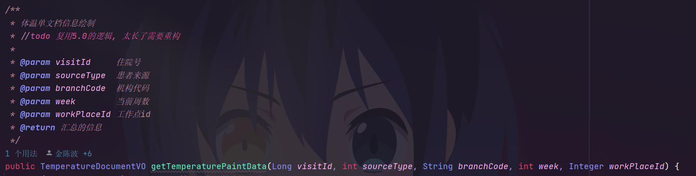
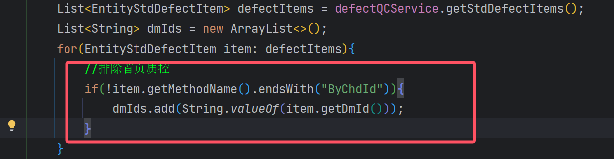
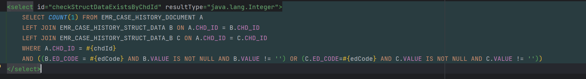

# KingT软件代码分析

#### 数据缓存服务-队列+线程


```java
@Component

public class DataCacheService {
    private static final Logger log = LoggerFactory.getLogger(DataCacheService.class);
    private static DataCenterService dataCenterService;
    public static DelayQueue<DelayedTask> delayQueue = new DelayQueue();

    public DataCacheService() {
    }

    @Autowired
    public void setDataCenterService(DataCenterService dcs) {
        dataCenterService = dcs;
    }

    static {
        (new Thread(() -> {
            while(true) {
                try {
                    log.info("定时刷新缓存");
                    DelayedTask task = (DelayedTask)delayQueue.take();
                    HashMap<String, Object> paramMap = (HashMap)task.getParameter();
                    dataCenterService.refreshRedisCache((RedisCacheEnum)paramMap.get("cache"), ConvertUtil.ToString(paramMap.get("branchCode"), ""), ConvertUtil.ToString(paramMap.get("empId"), ""));
                } catch (Exception var2) {
                    log.error("定时刷新缓存执行异常", var2);
                }
            }
        })).start();
    }
}
```

使用了静态代码块创建的独立线程作为缓存刷新的工作任务，通过在延时队列中获取相应的任务来进行任务的获取。

#### 消息消费处理类-KafKa消息队列

整个的消费者处理类为：

```java
@Component
public class KafkaConsumerManager {
    private static final Logger log = LoggerFactory.getLogger(KafkaConsumerManager.class);
    private final ConsumerFactory<String, Object> consumerFactory;
    private final ApplicationContext applicationContext;
    private static final Map<String, MessageListenerContainer> KAFKA_CONSUMER_THREAD_MAP = new LinkedHashMap();

    public KafkaConsumerManager(ConsumerFactory<String, Object> consumerFactory, ApplicationContext applicationContext) {
        this.consumerFactory = consumerFactory;
        this.applicationContext = applicationContext;
    }

    public synchronized void addConsumer(String key, KafkaListenerInfoProperties consumerInfo) {
        if (!ObjectUtils.isEmpty(consumerInfo)) {
            this.stopByConsumerId(key);
            MessageListenerContainer kafkaMessageListener = this.buildKafkaListenerContainerFactory(consumerInfo);
            KAFKA_CONSUMER_THREAD_MAP.put(key, kafkaMessageListener);
            kafkaMessageListener.start();
            log.info("创建消费者: {} 成功！", key);
        }
    }

    public void stopByConsumerId(String consumerId) {
        if (StringUtils.hasText(consumerId)) {
            MessageListenerContainer kafkaMessageListenerContainer = (MessageListenerContainer)KAFKA_CONSUMER_THREAD_MAP.get(consumerId);
            if (!ObjectUtils.isEmpty(kafkaMessageListenerContainer)) {
                kafkaMessageListenerContainer.stop();
                KAFKA_CONSUMER_THREAD_MAP.remove(consumerId);
                log.info("停止消费者: {} 成功！", consumerId);
            }
        }
    }

    private MessageListenerContainer buildKafkaListenerContainerFactory(KafkaListenerInfoProperties consumerInfo) {
        Assert.hasText(consumerInfo.getTopics(), "主题名称不能为空！");
        String[] topics = consumerInfo.getTopics().split(",");
        PgKafkaBatchMessageService pgKafkaBatchMessageService = this.getPgKafkaBatchMessageService(consumerInfo.getServiceCode());
        PgMessageListener pgMessageListener = this.getPgMessageListener(consumerInfo.getServiceCode());
        if (pgKafkaBatchMessageService == null && pgMessageListener == null) {
            throw new RuntimeException("主题" + consumerInfo.getTopics() + "无法找到对应的实现信息");
        } else {
            ConsumerFactory<String, Object> factory = new DefaultKafkaConsumerFactory(this.consumerFactory.getConfigurationProperties());
            ContainerProperties containerProperties = new ContainerProperties(topics);
            containerProperties.setGroupId(consumerInfo.getGroup());
            if (StringUtils.hasText(consumerInfo.getAckMode())) {
                try {
                    containerProperties.setAckMode(AckMode.valueOf(consumerInfo.getAckMode().toUpperCase()));
                    Map<String, Object> map = new HashMap();
                    map.put("enable.auto.commit", false);
                    factory.updateConfigs(map);
                } catch (Exception var8) {
                    log.error("自定义监听ACK模式错误{}", consumerInfo.getAckMode());
                }
            }

            containerProperties.setMessageListener(new KafkaBatchAckMessageListener(pgKafkaBatchMessageService, pgMessageListener));
            ConcurrentMessageListenerContainer<String, Object> listenerContainer = new ConcurrentMessageListenerContainer(factory, containerProperties);
            if (consumerInfo.getConcurrency() != null) {
                listenerContainer.setConcurrency(consumerInfo.getConcurrency());
            }

            return listenerContainer;
        }
    }

    private PgMessageListener getPgMessageListener(String serviceCode) {
        PgMessageListener pgMessageListener = null;

        try {
            pgMessageListener = (PgMessageListener)this.applicationContext.getBean(serviceCode, PgMessageListener.class);
        } catch (Exception var4) {
        }

        return pgMessageListener;
    }

    private PgKafkaBatchMessageService getPgKafkaBatchMessageService(String serviceCode) {
        PgKafkaBatchMessageService kafkaBatchMessageService = null;

        try {
            kafkaBatchMessageService = (PgKafkaBatchMessageService)this.applicationContext.getBean(serviceCode, PgKafkaBatchMessageService.class);
        } catch (Exception var4) {
        }

        return kafkaBatchMessageService;
    }
}
```

###### 用到的几个成员变量是常用的：

```java
private final ConsumerFactory<String, Object> consumerFactory;//消费者工厂
private final ApplicationContext applicationContext;
private static final Map<String, MessageListenerContainer> KAFKA_CONSUMER_THREAD_MAP = new LinkedHashMap();//消息监听容器
```

自定义的KafKa消费者信息Info类：

```java

public class KafkaListenerInfoProperties implements Serializable {
    private String topics;
    private String group;
    private String serviceCode;
    private String ackMode = "BATCH";
    private Integer concurrency;

    public KafkaListenerInfoProperties() {
    }
}
```

#### 自定义的任务调度：

```java
@EnableAspectJAutoProxy(
    proxyTargetClass = true
)
@Configuration
public class PgJobInitializing implements ApplicationRunner {
    private static final Logger log = LoggerFactory.getLogger(PgJobInitializing.class);
    private final DefaultListableBeanFactory beanFactory;

    public PgJobInitializing(DefaultListableBeanFactory beanFactory) {
        this.beanFactory = beanFactory;
    }

    public void run(ApplicationArguments args) {
        if (this.beanFactory != null) {
            try {
                ClassLoader classLoader = Thread.currentThread().getContextClassLoader();
                InputStream inputStream = classLoader.getResourceAsStream("META-INF/pg-job.json");
                if (inputStream == null) {
                    log.info("[PG_JOB]无有效规则文件");
                    return;
                }

                String json = new String(inputStream.readAllBytes(), StandardCharsets.UTF_8);
                List<PgJobAutoInfo> rules = JSON.parseArray(json, PgJobAutoInfo.class);
                if (rules.isEmpty()) {
                    return;
                }

                Iterator var6 = rules.iterator();

                while(var6.hasNext()) {
                    PgJobAutoInfo rule = (PgJobAutoInfo)var6.next();

                    try {
                        PgJobProxyUtil.replaceBeanProxyFactoryProxy(this.beanFactory, rule.getType());
                    } catch (Exception var9) {
                        log.error("", var9);
                    }
                }
            } catch (Exception var10) {
                PgFastLogger.appError("[PG_JOB]配置自动初始化失败", var10);
            }

        }
    }
}
```

#### 获取类加载器的方法：

```java
ClassLoader classLoader = Thread.currentThread().getContextClassLoader();
```

#### 实现方法的代理：

```java
@Configuration
public class PlugMethodInterceptor implements MethodInterceptor {
    private static final Logger log = LoggerFactory.getLogger(PlugMethodInterceptor.class);
    private final PgJobState pgJobState;
    private final PgJobTemplate pgJobTemplate;
    private final PgJobProperties pgJobProperties;
    private final ExecutorService pool;

    public PlugMethodInterceptor(PgJobProperties pgJobProperties, PgJobTemplate pgJobTemplate, PgJobState pgJobState) {
        this.pgJobProperties = pgJobProperties;
        this.pgJobTemplate = pgJobTemplate;
        this.pgJobState = pgJobState;
        this.pool = pgJobState.getPool();
        ClassLoader classLoader = Thread.currentThread().getContextClassLoader();
        InputStream inputStream = classLoader.getResourceAsStream("META-INF/pg-job.json");
        if (inputStream == null) {
            log.info("[PG_JOB]无有效规则文件");
        } else {
            String json;
            try {
                json = new String(inputStream.readAllBytes(), StandardCharsets.UTF_8);
            } catch (IOException var9) {
                throw new RuntimeException(var9);
            }

            List<PgJobAutoInfo> rules = JSON.parseArray(json, PgJobAutoInfo.class);
            if (!rules.isEmpty()) {
                Map<String, List<PgJobAutoInfo>> stringListMap = (Map)rules.stream().collect(Collectors.groupingBy(PgJobAutoInfo::getType));
                stringListMap.forEach((type, methods) -> {
                    List<String> strings = new ArrayList();
                    Iterator var4 = methods.iterator();

                    while(var4.hasNext()) {
                        PgJobAutoInfo method = (PgJobAutoInfo)var4.next();
                        strings.addAll(method.getMethods());
                    }

                    pgJobState.putPgJobMethods(type, strings);
                });
            }

        }
    }

    public Object invoke(@NonNull MethodInvocation invocation) throws Throwable {
        List<String> methods = this.pgJobState.getPgJobMethods(invocation.getMethod().getDeclaringClass().getName());
        if (methods != null && !methods.isEmpty()) {
            if (methods.contains(invocation.getMethod().toString())) {
                Object obj = invocation.proceed();
                this.pool.execute(() -> {
                    this.doJobSend(invocation.getArguments());
                });
                return obj;
            } else {
                return invocation.proceed();
            }
        } else {
            return invocation.proceed();
        }
    }

    private void doJobSend(Object params) {
        PgJobInfo pgJobInfo = PgJobInfo.getInstance().jobCode(this.pgJobProperties.getAutoSender().getJobCode());
        this.pgJobTemplate.sendJob(pgJobInfo, params);
    }
}
```

可以看到是实现了MethodInvokeHandler接口

#### 设计架构层次分析，单体的任务调度


从公司的核心代码，包括消息消费，缓存处理，数据库数据源处理，业务抽象层面的代码到下面的单个部门代码分析来看，上层的代码比下层单部门代码的抽象程度高得多，上层代码设计的业务抽象层次很深，下层代码主要是数据处理层面的，而且大部分的数据直接依靠SQL，通过Collections集合Lamda表达式处理数据，多数据查询使用分页limit逻辑。

  

这一张表272个列字段，三个索引，总数据量970W，真不知道怎么想的了。

#### 关于服务的配置-application.yml-bootstrap.yml

搜索代码和查所有EMR开头的表名是否在EMR代码中使用，CIS系统代码后续会发。

查询所有字段EMR中，EMR在用的字段写好注释。没有用的字段写好否就是了

ORACLE数据库使用命令来插入数据，后续需要完成的。

#### MySQL数据库和Oracle数据库的数据类型对应关系：

| 说明                                                                                                                                                                                               | mysql                                                                                                                                                                                                                                                                                                                                                  | oracle                                                                                                                                                                                                                             |
| -------------------------------------------------------------------------------------------------------------------------------------------------------------------------------------------------- | ------------------------------------------------------------------------------------------------------------------------------------------------------------------------------------------------------------------------------------------------------------------------------------------------------------------------------------------------------ | ---------------------------------------------------------------------------------------------------------------------------------------------------------------------------------------------------------------------------------- |
| 变长字符串                                                                                                                                                                                         | VARCHAR[0-65535]定义长度默认按字符长度计算，如果是GBK编码的汉字将占用2个字节                                                                                                                                                                                                                                                                           | VARCHAR2[1-4000]``VARCHAR是VARCHAR2的同义词定义默认按字节长度计算                                                                                                                                                                  |
| 整数                                                                                                                                                                                               | TINYINT(-128-127)SMALLINT(-32768-32767)MEDIUMINT(-8388608-8388607)INT(-2147483648-2147483647)``BIGINT(-9223372036854775808-9223372036854775807)                                                                                                                                                                                                        | 无专用类型，TINYINT可以用NUMBER(3,0)代替SMALLINT可以用NUMBER(5,0)代替MEDUIMINT可以用NUMBER(7,0)代替 `` INT可以用NUMBER(10,0)代替`` BIGINT可以用NUMBER(20,0)代替`` ORACLE中有SMALLINT,INT,INTEGER类型，不过这是NUMBER(38,0)的同义词 |
| 数值类型                                                                                                                                                                                           | DECIMAL[1-65[,0-30]]``NUMERIC是DECIMAL的同义词                                                                                                                                                                                                                                                                                                         | NUMBER 可表示数范围： 1*10^-130至1*10^126NUMBER([1-38][,-84-127])DECIMAL、NUMERIC、DEC是NUMBER的同义词                                                                                                                           |
| 浮点型                                                                                                                                                                                             | FLOAT(D,M)                                                                                                                                                                                                                                                                                                                                             | oracle10g开始增加BINARY_FLOAT类型10g以前无专用类型，可以用NUMBER代替ORACLE中有FLOAT和REAL类型，不过这是NUMBER的同义词                                                                                                              |
| 双精度浮点型                                                                                                                                                                                       | DOUBLE(D,M)                                                                                                                                                                                                                                                                                                                                            | oracle10g开始增加BINARY_DOUBLE类型10g以前无专用类型，可以用NUMBER代替ORACLE中有DOUBLE PRECISION类型，不过这是NUMBER的同义词                                                                                                        |
| 位类型                                                                                                                                                                                             | BIT(1-64)                                                                                                                                                                                                                                                                                                                                              | 无                                                                                                                                                                                                                                 |
| 日期类型                                                                                                                                                                                           | DATE，3字节存储，只存储日期，没有时间，支持范围是[1000-01-01]至[9999-12-31]``TIME，3字节存储，只存储时间，没有日期，支持范围是[-838:59:59]至[838:59:59]``DATETIME，占8字节存储，可表示日期和时间，支持范围是[1000-01-01 00:00:00]至[9999-12-31 23:59:59]``TIMESTAMP，占4字节存储，可表示日期和时间，范围是[1970-01-01 00:00:00]至[2038-01-19 03:14:07] | DATE类型``7字节存储，可表示日期和时间，支持范围是[-4712-01-01 00:00:00]至[9999-12-31 23:59:59]                                                                                                                                     |
| 高精度日期                                                                                                                                                                                         | 5.6.4以前不支持小数秒精度``5.6.4开始TIME,DATETIME,TIMESTAMP支持，最多可以6位小数秒，也就是微秒级别                                                                                                                                                                                                                                                     | TIMESTAMP[0-9]``占用空间7-11个字节，当小数秒精度为0时与DATE类型相同，小数秒最高精度可达9位，也就是纳精度                                                                                                                           |
| 年份                                                                                                                                                                                               | YEAR，1字节存储，只存储年份，支持范围是[1901]至[2155]                                                                                                                                                                                                                                                                                                  | 无对应类型，可以用NUMBER(3,0)代替                                                                                                                                                                                                  |
| 定长字符串                                                                                                                                                                                         | CHAR[0-255]，定义长度默认按字符长度计算，最大保存255字符                                                                                                                                                                                                                                                                                               | CHAR[1-2000]定义默认按字节长度计算                                                                                                                                                                                                 |
| 无符号说明                                                                                                                                                                                         | 支持，用于数值类型                                                                                                                                                                                                                                                                                                                                     | 不支持                                                                                                                                                                                                                             |
| 大字符串，一般用于存储文本文件或超大描述及备注类信息                                                                                                                                               | TINYTEXT 最大支持255个字节 ``TEXT最大支持65535个字节``MEDIUMTEXT最大支持16MB个字节 ``LONGTEXT最大支持4GB字节`` ``字段不支持默认值                                                                                                                                                                                                                      | 支持(CLOB)``oracle10g以前最大支持4GB个字节oracle10g开始最大支持4GB个数据块，数据块大小为2KB-32KBoracle还有一个LONG类型，是早期的存储大字符串类型，最大支持2GB字节,现已不推荐使用                                                   |
| 二进制对象，一般用于存储文件或图片数据                                                                                                                                                             | TINYBLOB 最大支持255个字节 ``BLOB最大支持65535个字节``MEDIUMBLOB最大支持16MB个字节LONGBLOB最大支持4GB字节字段不支持默认值                                                                                                                                                                                                                              | 支持(BLOB)oracle10g以前最大支持4GB个字节`` oracle10g开始最大支持4G个数据块，数据块大小为2KB-32KBoracle还有一个LONG RAW类型，是早期的存储二进制类型，最大支持2GB字节,现已不推荐使用                                                 |
| 二进制信息                                                                                                                                                                                         | BINARY(0-255)，定长``VARBINARY(0-65535)，变长                                                                                                                                                                                                                                                                                                          | RAW(1-2000)                                                                                                                                                                                                                        |
| 枚举类型                                                                                                                                                                                           | ENUM(v1,v2,v3,...),最多65535个元素                                                                                                                                                                                                                                                                                                                     | 不支持                                                                                                                                                                                                                             |
| 集合类型                                                                                                                                                                                           | SET(v1,v2,v3,...)，最多64个元素                                                                                                                                                                                                                                                                                                                        | 不支持                                                                                                                                                                                                                             |
| 国际化字符集类型，较少使用                                                                                                                                                                         | 无，MYSQL可以对每个字段指定字符编码                                                                                                                                                                                                                                                                                                                    | 支持 ``NCHAR(1-2000)``NVARCHAR(1-4000)``NCLOB                                                                                                                                                                                      |
| 外部文件指针类型                                                                                                                                                                                   | 不支持                                                                                                                                                                                                                                                                                                                                                 | 支持 ``文件大小最大4GB``文件名称最长255字符                                                                                                                                                                                        |
|                                                                                                                                                                                                    | 不支持                                                                                                                                                                                                                                                                                                                                                 | 支持                                                                                                                                                                                                                               |
|                                                                                                                                                                                                    | 不支持                                                                                                                                                                                                                                                                                                                                                 | 支持                                                                                                                                                                                                                               |
| 自动增长类型                                                                                                                                                                                       | 支持``使用简单                                                                                                                                                                                                                                                                                                                                         | 不支持``一般使用SEQUENCE解决，用法与自增类型差别较大，使用较复杂，但能实现非常灵活的应用，包括字符自增主键、全局主键等等                                                                                                           |
|                                                                                                                                                                                                    | 不支持函数和表达式``TEXT和BLOB字段类型不支持默认值                                                                                                                                                                                                                                                                                                     | 支持函数和表达式                                                                                                                                                                                                                   |
|                                                                                                                                                                                                    | 支持，例如，把emp表的id字段顺序放在name字段后面：``alter table emp modify column id varchar(20) after name;                                                                                                                                                                                                                                            | 不支持，只能重建表或字段                                                                                                                                                                                                           |
| 虚拟字段是一个逻辑字段定义，其结果值通常是一个表达式，并在表中存储物理值，不占用空间，主要用于简化查询逻辑。比如有一个商品销售表有单价和数量两个字段，那可以建一个虚拟字段金额，其表达式=单价*数量 | 不支持                                                                                                                                                                                                                                                                                                                                                 | 11g支持，例：``create table sales``(``id       number,``quantity number,``price    number,``amount   GENERATED always as (quantity*price) virtual``);                                                                              |
|                                                                                                                                                                                                    | INNODB 最大1000个字段 ``所有字段总定义长度不能超过65535字节``所有固定长度字段的总长度不超过半个数据块大小(数据块大小一般为16K)                                                                                                                                                                                                                         | 最大1000个字段                                                                                                                                                                                                                     |

**二、MySQL与Oracle数据库常见数据类型对应关系**

| 编号 | ORACLE                                                                   | MYSQL                                                                                          | 注释                                                                                                                                                                                                                                                                                                                                                                                                                                                                                                                                                                                                                                                                                                                                                                                                                                                                                                                   |
| ---- | ------------------------------------------------------------------------ | ---------------------------------------------------------------------------------------------- | ---------------------------------------------------------------------------------------------------------------------------------------------------------------------------------------------------------------------------------------------------------------------------------------------------------------------------------------------------------------------------------------------------------------------------------------------------------------------------------------------------------------------------------------------------------------------------------------------------------------------------------------------------------------------------------------------------------------------------------------------------------------------------------------------------------------------------------------------------------------------------------------------------------------------- |
| 1    | NUMBER                                                                   | int / DECIMAL                                                                                  | DECIMAL就是NUMBER(10,2)这样的结构INT就是是NUMBER(10)，表示整型；``MYSQL有很多类int型，tinyint mediumint bigint等，不同的int宽度不一样                                                                                                                                                                                                                                                                                                                                                                                                                                                                                                                                                                                                                                                                                                                                                                                  |
| 2    | Varchar2（n）                                                            | varchar(n)                                                                                     |                                                                                                                                                                                                                                                                                                                                                                                                                                                                                                                                                                                                                                                                                                                                                                                                                                                                                                                        |
| 3    | Date                                                                     | DATATIME                                                                                       | 日期字段的处理 ``MYSQL日期字段分DATE和TIME两种，ORACLE日期字段只有DATE，包含年月日时分秒信息，用当前数据库的系统时间为 SYSDATE, 精确到秒，或者用字符串转换成日期型函数TO_DATE(‘2001-08-01','YYYY-MM-DD')年-月-日 24小时:分钟:秒的格式YYYY-MM-DD HH24:MI:SS TO_DATE()还有很多种日期格式, 可以参看ORACLE DOC.日期型字段转换成字符串函数TO_CHAR(‘2001-08-01','YYYY-MM-DD HH24:MI:SS')`` ``日期字段的数学运算公式有很大的不同。MYSQL找到离当前时间7天用 DATE_FIELD_NAME ＞ SUBDATE（NOW（），INTERVAL 7 DAY）ORACLE找到离当前时间7天用 DATE_FIELD_NAME ＞SYSDATE - 7;`` ``MYSQL中插入当前时间的几个函数是：NOW()函数以`'YYYY-MM-DD HH:MM:SS'返回当前的日期时间，可以直接存到DATETIME字段中。CURDATE()以'YYYY-MM-DD'的格式返回今天的日期，可以直接存到DATE字段中。CURTIME()以'HH:MM:SS'的格式返回当前的时间，可以直接存到TIME字段中。例：insert into tablename (fieldname) values (now())`` ``而oracle中当前时间是sysdate |
| 4    | INTEGER                                                                  | int / INTEGER                                                                                  | Mysql中INTEGER等价于int                                                                                                                                                                                                                                                                                                                                                                                                                                                                                                                                                                                                                                                                                                                                                                                                                                                                                                |
| 5    | EXCEPTION                                                                | SQLEXCEPTION                                                                                   | 详见<<2009001-eService-O2MG.doc>>中2.5 Mysql异常处理                                                                                                                                                                                                                                                                                                                                                                                                                                                                                                                                                                                                                                                                                                                                                                                                                                                                   |
| 6    | CONSTANT VARCHAR2(1)                                                     | mysql中没有CONSTANT关键字                                                                      | 从ORACLE迁移到MYSQL,所有CONSTANT常量只能定义成变量                                                                                                                                                                                                                                                                                                                                                                                                                                                                                                                                                                                                                                                                                                                                                                                                                                                                     |
| 7    | TYPE g_grp_cur IS REF CURSOR;                                            | 光标 : mysql中有替代方案                                                                       | 详见<<2009001-eService-O2MG.doc>>中2.2 光标处理                                                                                                                                                                                                                                                                                                                                                                                                                                                                                                                                                                                                                                                                                                                                                                                                                                                                        |
| 8    | TYPE unpacklist_type IS TABLE OF VARCHAR2(2000) INDEX BY BINARY_INTEGER; | 数组: mysql中借助临时表处理 ``或者直接写逻辑到相应的代码中，``直接对集合中每个值进行相应的处理 | 详见<<2009001-eService-O2MG.doc>>中2.4 数组处理                                                                                                                                                                                                                                                                                                                                                                                                                                                                                                                                                                                                                                                                                                                                                                                                                                                                        |
| 9    | 自动增长的序列                                                           | 自动增长的数据类型                                                                             | MYSQL有自动增长的数据类型，插入记录时不用操作此字段，会自动获得数据值。ORACLE没有自动增长的数据类型，需要建立一个自动增长的序列号，插入记录时要把序列号的下一个值赋于此字段。                                                                                                                                                                                                                                                                                                                                                                                                                                                                                                                                                                                                                                                                                                                                          |
| 10   | NULL                                                                     | NULL                                                                                           | 空字符的处理``MYSQL的非空字段也有空的内容，ORACLE里定义了非空字段就不容许有空的内容。按MYSQL的NOT NULL来定义ORACLE表结构, 导数据的时候会产生错误。因此导数据时要对空字符进行判断，如果为NULL或空字符，需要把它改成一个空格的字符串。                                                                                                                                                                                                                                                                                                                                                                                                                                                                                                                                                                                                                                                                                   |

**MySQL与Oracle 差异比较之基本语法**

| 编号                               | 类别                                                                | ORACLE                                                                                                                                                                                                                      | MYSQL                                                                                                                                                                                                                                   | 注释                                                                                                                                                                                                                             |
| ---------------------------------- | ------------------------------------------------------------------- | --------------------------------------------------------------------------------------------------------------------------------------------------------------------------------------------------------------------------- | --------------------------------------------------------------------------------------------------------------------------------------------------------------------------------------------------------------------------------------- | -------------------------------------------------------------------------------------------------------------------------------------------------------------------------------------------------------------------------------- |
| 1                                  | 变量的声明方式不同                                                  | li_index NUMBER := 0                                                                                                                                                                                                        | DECLARE li_index INTEGER DEFAULT 0                                                                                                                                                                                                      | 1. mysql 使用DECLARE定义局部变量.``定义变量语法为:  DECLARE var_name[,...] type [DEFAULT value] 要给变量提供一个默认值，需要包含一个DEFAULT子句。值可以被指定为一个表达式，不需要为一个常数。如果没有DEFAULT子句，初始值为NULL。 |
| 2                                  | 变量的赋值方式不同                                                  | lv_inputstr := iv_inputstr                                                                                                                                                                                                  | SET lv_inputstr = iv_inputstr                                                                                                                                                                                                           | 1. oracle变量赋值使用:=``mysql 使用赋值使用set关键字. 将一个值赋给一个变量时使用"=".                                                                                                                                             |
| 3                                  | 跳出（退出）语句不同                                                | EXIT;                                                                                                                                                                                                                       | LEAVE procedure name;                                                                                                                                                                                                                   | 1. oracle: 如果exit语句在循环中就退出当前循环.如果exit语句不再循环中,就退出当前过程或方法.``Mysql: 如果leave语句后面跟的是存储过程名,则退出当前存储过程. 如果leave语句后面跟的是lable名. 则退出当前lable.``                      |
| while 条件 loop ``exit;``end loop; | label_name:while 条件 do ``leave label_name;``end while label_name; |                                                                                                                                                                                                                             |                                                                                                                                                                                                                                         |                                                                                                                                                                                                                                  |
| 4                                  | 定义游标                                                            | TYPE g_grp_cur IS REF CURSOR;``                                                                                                                                                                                             | DECLARE cursor_name CURSOR FOR SELECT_statement;                                                                                                                                                                                        | oracle可以先定义游标,然后给游标赋值.``mysql定义游标时就需要给游标赋值. Mysql定义游标出自 Mysql 5.1 参考手册20.2.11.1.声明光标.                                                                                                   |
| 5                                  | 定义数组                                                            | TYPE unpacklist_type IS TABLE OF VARCHAR2(2000) INDEX BY BINARY_INTEGER;                                                                                                                                                    | 可以使用临时表代替oracle数组, 也可以循环拆分字符来替代oracle数组.                                                                                                                                                                       | 目前可以使用临时表来代替oracle数组.``详见<<2009002-OTMPPS-Difficult Questions-0001.doc>>中2.4 Mysql数组处理部分                                                                                                                  |
| 6                                  | 注释方式不同                                                        | "-- message"  或 "/** ….*/" 或"/* ….  */"                                                                                                                                                                               | "-- message"  或 "/* ….  */" 或 "#"                                                                                                                                                                                                    | mysql注释来自  MySQL 5.1参考手册 9.5. 注释语法, 建议同oracle一样, 单行用--, 多行/* */                                                                                                                                            |
| 7                                  | 自带日期时间函数格式不同                                            | Oracle时间格式：yyyy-MM-dd hh:mi:ss                                                                                                                                                                                         | Mysql时间格式：%Y-%m-%d %H:%i:%s                                                                                                                                                                                                        | 1. MYSQL日期字段分DATE和TIME两种.``ORACLE日期字段只有DATE，包含年月日时分秒信息.``2. mysql中取当前系统时间为now()函数,精确到秒.``oracle中取当前数据库的系统时间为SYSDATE, 精确到秒.                                              |
| 8                                  | 日期加减                                                            | 当前时间加N天: sysdate+N``当前时间减N天: sysdate-N                                                                                                                                                                          | 日期相加: date_add(now(), INTERVAL 180 DAY)``日期相减: date_sub('1998-01-01 00:00:00', interval '1 1:1:1' day_second)                                                                                                                   |                                                                                                                                                                                                                                  |
| 9                                  | 字符串连接符不同                                                    | result  := v_int1                                                                                                                                                                                                           |                                                                                                                                                                                                                                         | v_int2;                                                                                                                                                                                                                          |
| 10                                 | 定义游标不同                                                        | CURSOR l_bk_cur IS ``SELECT B.BK_HDR_INT_KEY, B.BK_NUM``FROM ES_SR_DTL_VRB A, ES_BK_HDR B ``WHERE A.BK_HDR_INT_KEY = B.BK_HDR_INT_KEY``AND b.BK_STATUS != ES_BK_PKG.g_status_can``AND A.SR_HDR_INT_KEY = ii_sr_hdr_int_key; | DECLARE l_bk_cur CURSOR ``FOR SELECT B.BK_HDR_INT_KEY, B.BK_NUM``FROM ES_SR_DTL_VRB A, ES_BK_HDR B ``WHERE A.BK_HDR_INT_KEY = B.BK_HDR_INT_KEY``AND b.BK_STATUS != ES_BK_PKG.g_status_can ``AND A.SR_HDR_INT_KEY = ii_sr_hdr_int_key;`` | 详见<<2009002-OTMPPS-Difficult Questions-0001.doc>>中2.2 Mysql游标处理部分                                                                                                                                                       |
| 11                                 | 事务回滚                                                            | ROLLBACK;                                                                                                                                                                                                                   | ROLLBACK;                                                                                                                                                                                                                               | oracle和mysql中使用方法相同                                                                                                                                                                                                      |
| 12                                 | GOTO语句                                                            | GOTO check_date;                                                                                                                                                                                                            | GOTO check_date;                                                                                                                                                                                                                        | oracle和mysql中使用方法相同                                                                                                                                                                                                      |

#### 住院清单接口分析

来看看这个接口，在问了同事学长之后，了解到这是一个比较复杂的接口。现在来分析下。



要返回的数据是体温单数据，先来看看返回的VO视图实体。

```java
@Getter
@Setter
@Schema(name = "TemperatureDocumentVO", description = "体温信息文档对象")
public class TemperatureDocumentVO {

    @Schema(description = "开始时间")
    private LocalDateTime beginDate;

    @Schema(description = "截至时间")
    private LocalDateTime endDate;

    @Schema(description = "体温单标题")
    private String title;

    @Schema(description = "一页展示的天数")
    private Integer numOfDaysInOnePage;

    @Schema(description = "住院天数")
    private long inDays;

    @Schema(description = "住院周数")
    private int weeks;

    @Schema(description = "第几周")
    private int currentWeek;

    @Schema(description = "标题列表")
    private List<VitalSignsTitleVO> titleList;

    @Schema(description = "患者信息列表")
    private List<TemperatureHeaderLabelVO> patInfoList;

    @Schema(description = "顶行列表")
    private List<TemperatureLineVO> headerLines;

    @Schema(description = "尾行列表")
    private List<TemperatureLineVO> footerLines;

    @Schema(description = "折线展示数列表")
    private List<TemperatureYAxisInfoVO> yAxises;

    @Schema(description = "备注列表")
    private List<TemperatureTimePointDataVO> remarkMaskList;

    @Schema(description = "时间刻度列表")
    private List<VitalSignsTimeScaleVO> timeScaleList;

    @Schema(description = "体温单格式相关设置信息")
    private VitalSignsSetupVO config;
}
```

公司的需求管理平台是禅道和业财一体化


开发流程控制如上，需求信息界面会展示具体更新的需求功能和需求上线等信息，以前端需求为例，将会展示具体按钮，病历文书页眉随场景（孕妇）变化，时间信息等。

需求总览：


#### 测试质控缺陷代码工作记录

```java
    /**
     * 获取质控缺陷项判断结果（多个）
     *
     * @param para
     * @return
     */
    @RequestMapping("/GetMultiEDefectResult")
    @NoAuth
    public Object getMultiElementsValue(@RequestBody EntityDefectPara para) {
        if (para == null)
            throw new TipException(999, "获取质控结果入参有误");
        List<EntityStdDefectItem> defectItems = defectQCService.getStdDefectItems();
        List<String> dmIds = new ArrayList<>();
        for(EntityStdDefectItem item: defectItems){
            //排除首页质控
            if(!item.getMethodName().endsWith("ByChdId")){
                dmIds.add(String.valueOf(item.getDmId()));
            }
        }
        para.setDmIds(String.join(",", dmIds));
        return JsonResult.create(defectQCService.getMultiElementsValue(para));
    }

    @RequestMapping("/GetMultiEDefectResultByChdId")
    @NoAuth
    public Object GetMultiEDefectResultByChdId(@RequestBody EntityDefectPara para) {
        if (para == null)
            throw new TipException(999, "获取质控结果入参有误");
        List<EntityStdDefectItem> defectItems = defectQCService.getStdDefectItems();
        List<String> dmIds = new ArrayList<>();
        for(EntityStdDefectItem item: defectItems){
            //排除首页质控
            if(item.getMethodName().endsWith("ByChdId")){
                dmIds.add(String.valueOf(item.getDmId()));
            }
        }
        para.setDmIds(String.join(",", dmIds));
        return JsonResult.create(defectQCService.getMultiElementsValueByChdId(para));
    }
```

##### 获取质控缺陷项判断结果（多个）


报错信息：将Column 'id' in field list is [ambiguous](https://so.csdn.net/so/search?q=ambiguous&spm=1001.2101.3001.7020)翻译成中文就是字段列表中的列id不明确

修改SQL指定表名后：

```sql
 SELECT ID, CODE, NAME, PARENT_ID, IS_LEAF, A.IS_MED, PHARM_CODE, INPUTCODE1, INPUTCODE2, ORD, C.STATE, C.MODIFY_EMPID, C.MODIFY_TIME, LIMIT_TYPE, ALLERGEN_TYPE
        FROM pub_allergen A, PAT_REG_ALLERGEN B, CIS_IN_PAT_REG C
        WHERE A.ID = B.allergen_id AND B.reg_id = C.visit_id AND B.source_type = 2
          AND B.invalid_time IS NULL
```

根据接口显示：


这之中筛选出对应的方法，然后进行反射调用



然而这里面有3000多个方法要逐个进行反射调用，经过断点调试我发现，只能说是其中一个吧，我也不知道如何修改了。


我发现这里面有3000多个方法，也就是数据库里面存的，全部都是内部使用反射来调用的，直接通过Web方法来测试效率真的太低了。

###### 尝试想一下别的办法来进行测试。

经过帮忙，发现调用方法的代理入参类型不对，修改Long为long

checkPedsContacts

checkStructValueContainsByChdId

checkChiefDoctorRecordCount

改正的SQL：

```SQL
SELECT A.NAME, A.SEX, B.VISIT_NO,
        CASE sex WHEN 1 THEN '男' WHEN 2 THEN '女' ELSE '其他' END AS SEX_NAME,
        DATE_FORMAT(A.DATE_OF_BIRTH, '%Y-%m-%d %H:%i:%s') DATE_OF_BIRTH,
        (EXTRACT(YEAR FROM B.WARD_IN_TIME) - EXTRACT(YEAR FROM A.DATE_OF_BIRTH)) AS AGE,
        <if test="_databaseId == 'mysql'">
            COALESCE(DATEDIFF(B.CLN_OUT_TIME, B.WARD_IN_TIME), 1) IN_DAY,
        </if>
        <if test="_databaseId == 'oracle'">
            NVL(B.CLN_OUT_TIME - B.WARD_IN_TIME, 1) IN_DAY,
        </if>
        -- 使用reg_time替代WARD_IN_TIME（假设这是一个合理的替代）
        STR_TO_DATE(DATE_FORMAT(A.reg_time, '%Y-%m-%d %H'),'%Y-%m-%d %H') AS WARD_IN_TIME,
        B.OUT_WAY,
        B.STATE,
        B.DEPT_ID,
        (SELECT NAME FROM PUB_EMP WHERE ID = B.CHIEF_DOCTOR) CHIEF_DOCTOR_NAME,
        (SELECT NAME FROM PUB_DEPT WHERE ID = B.DEPT_ID) AS DEPT_NAME,
        (SELECT NAME FROM PUB_WARD WHERE ID = B.WARD_ID) AS WARD_NAME,
        (SELECT NAME FROM PUB_WARD_BED WHERE ID = B.BED_ID) AS BED_NAME,
        date_format(B.CLN_OUT_TIME, '%Y-%m-%d %H:%i:%s') CLN_OUT_TIME,
        (SELECT CONCAT(DIAG_NAME) FROM CIS_IN_PAT_DIAG T1,CIS_DIC_DIAGNOSE_TYPE T2
        WHERE T1.DIAG_TYPE = T2.ID AND T1.VISIT_ID = B.VISIT_ID
        AND T1.DEL_TIME IS NULL AND T2.STD_ID = 6) AS OUT_DIAG,
        (SELECT CONCAT(DIAG_ICD) FROM CIS_IN_PAT_DIAG_MRHP WHERE MRHP_DIAG_TYPE = 1 AND VISIT_ID = B.VISIT_ID
        AND DIAG_ICD IS NOT NULL AND DIAG_NAME IS NOT NULL
        AND IS_TCM = 0 AND STATUS = 0 AND DEL_TIME IS NULL) DIAG_CODE
        FROM PAT_REGISTER A,CIS_IN_PAT_REG B WHERE A.REG_ID = B.VISIT_ID AND A.REG_ID = #{regId} AND A.SOURCE_TYPE = 2;
```

并不知道这段SQL是想干嘛，用的也是公司自己写得条件函数，直接查询SQL也不对，看不懂。

#### 现在开始测试Oracle数据库的方法问题。

切换nacos的配置文件到


即可切换数据源到Oracle上面

#### Oracle数据源下方法异常情况：

##### 1.数据类型与期望的类型不一致




涉及到的数据列的数据类型与期望的类型不一致

##### 2.数据类型与期望的类型不一致


##### 关于数据库连接工具：


工作台界面：


感觉还可以，emm。

#### 来看看Mybatis是如何进行SQL方法代理的：


向下抛出异常：


#### Nacos配置组group和环境隔离的实际操作


上面那部分是大的环境隔离，下面那个则是大环境下的配置组，这样子即使他们的配置名是一样的，还是可以通过group来找到对应的配置项。
