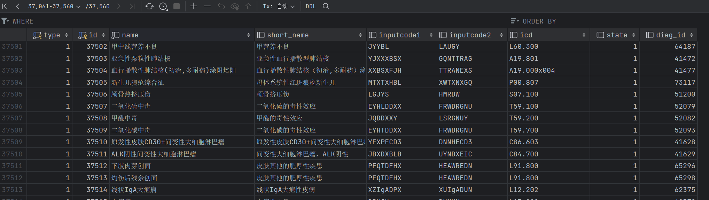
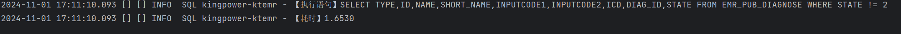
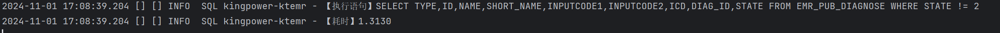
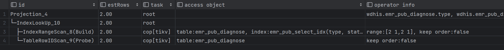

# SQL优化记录

#### 尝试通过索引来优化查询记录

这次在测试接口的过程中，发现有一张表的数据量达到了3W+，而使用的SQL语句则非常简单，基本上都得走全表扫描：

表结构如下，发现type和state基本上都是数值相同的字段



SQL语句如下：

```sql
SELECT TYPE,ID,NAME,SHORT_NAME,INPUTCODE1,INPUTCODE2,ICD,DIAG_ID,STATE FROM EMR_PUB_DIAGNOSE WHERE STATE != 2

            AND STATE = 1

            AND TYPE = 2;
```

尝试加上联合索引：


加联合索引之前的查询效率：




在这之前我使用**FLUSH QUERY CACHE来清除DB缓存**

加联合索引之后的查询效率：




看起来稍微快了点。

优化之前：

```
Projection_4,37556.00,root,"","wdhis.emr_pub_diagnose.type, wdhis.emr_pub_diagnose.id, wdhis.emr_pub_diagnose.name, wdhis.emr_pub_diagnose.short_name, wdhis.emr_pub_diagnose.inputcode1, wdhis.emr_pub_diagnose.inputcode2, wdhis.emr_pub_diagnose.icd, wdhis.emr_pub_diagnose.diag_id, wdhis.emr_pub_diagnose.state"
└─TableReader_7,37556.00,root,"",data:Selection_6
  └─Selection_6,37556.00,cop[tikv],"","eq(wdhis.emr_pub_diagnose.state, 1), eq(wdhis.emr_pub_diagnose.type, 1)"
    └─TableFullScan_5,37560.00,cop[tikv],table:emr_pub_diagnose,keep order:false
```

###### 发现执行计划确实不走全表扫描了：



看来联合索引好像就算查询的字段是所有字段也可以优化查询。同时给查询条件加索引也可以优化查询。
